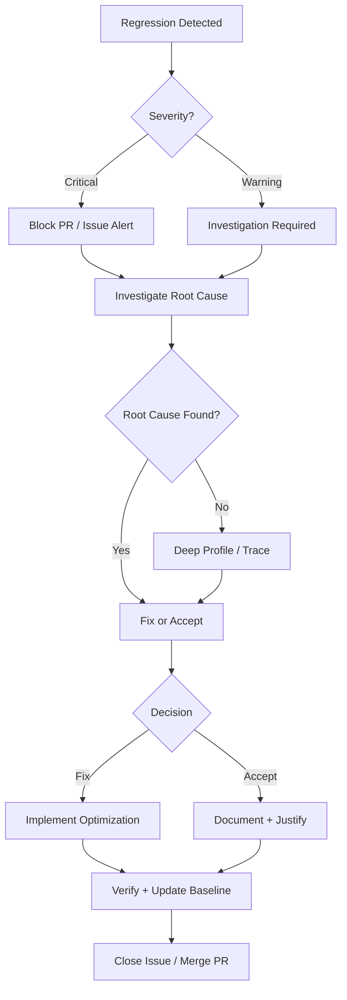

# Benchmark Regression Tracking

Performance is critical to BrainChat. This document describes how to establish performance baselines, detect regressions, track historical trends, and maintain acceptable performance thresholds over time.

## Table of Contents
1. [Establishing Baselines](#establishing-baselines)
2. [Detecting Regressions](#detecting-regressions)
3. [Historical Tracking](#historical-tracking)
4. [Acceptable Thresholds](#acceptable-thresholds)
5. [Recovery Process](#recovery-process)
6. [Automated Detection (CI/CD)](#automated-detection-cicd)
7. [Tools and Scripts](#tools-and-scripts)

---

## Establishing Baselines

### Purpose
Baselines represent the "gold standard" performance characteristics of BrainChat at a specific version. All future comparisons measure against the baseline to detect regressions.

### When to Establish Baselines
- **Major releases** (v1.0, v2.0, etc.) - Before merging to main
- **After significant optimization** - When performance improves substantially
- **Quarterly reviews** - Refresh baselines to track expected drift
- **After infrastructure changes** - New hardware, cloud region, etc.

### Baseline Establishment Procedure

#### Step 1: Prepare Environment
```bash
# Ensure clean, reproducible environment
npm install --clean-cache
# Clear any caches
rm -rf .cache node_modules/.cache
# Verify Node version
node --version  # Document this
```

#### Step 2: Run Full Benchmark Suite
```bash
npm run benchmark:full
```

This runs benchmarks for:
- LLM TTFT (Time To First Token)
- Voice first audio latency
- STT (Speech-to-Text) latency
- Context handling performance
- Memory consumption under load

#### Step 3: Save Results
Results are automatically saved to:
```
benchmarks/baseline.json
```

File structure:
```json
{
  "version": "1.0.0",
  "timestamp": "2024-01-15T10:30:00Z",
  "environment": {
    "node_version": "20.10.0",
    "os": "macOS 14.2",
    "hardware": "M2 Pro, 16GB RAM",
    "npm_packages": "npm run packages:versions"
  },
  "metrics": {
    "llm_ttft_ms": {
      "mean": 450,
      "p50": 425,
      "p95": 650,
      "p99": 800,
      "stddev": 120
    },
    "voice_first_audio_ms": {
      "mean": 280,
      "p50": 260,
      "p95": 400,
      "p99": 500,
      "stddev": 85
    },
    "stt_latency_ms": {
      "mean": 150,
      "p50": 140,
      "p95": 200,
      "p99": 250,
      "stddev": 40
    },
    "context_switch_ms": {
      "mean": 50,
      "p50": 45,
      "p95": 80,
      "p99": 120,
      "stddev": 20
    },
    "memory_peak_mb": 256,
    "memory_baseline_mb": 128
  }
}
```

#### Step 4: Document and Commit
```bash
# Create a commit with baseline
git add benchmarks/baseline.json
git commit -m "chore: establish baseline for v1.0.0

Baseline established on M2 Pro hardware
- LLM TTFT: 450ms (p95: 650ms)
- Voice audio: 280ms (p95: 400ms)
- STT latency: 150ms (p95: 200ms)

Environment: Node 20.10.0, macOS 14.2"

# Tag the release
git tag -a baseline/v1.0.0 -m "Performance baseline for v1.0.0"
git push origin main --tags
```

---

## Detecting Regressions

### What is a Regression?
A regression occurs when a performance metric degrades beyond acceptable thresholds. Regressions indicate:
- Code changes have slowed down a system component
- Dependencies have introduced overhead
- Compiler/runtime optimization opportunities were missed

### Manual Regression Detection

#### Run Regression Comparison
```bash
npm run benchmark:compare
```

This compares current performance against `benchmarks/baseline.json` and outputs:
```
Performance Comparison Report
━━━━━━━━━━━━━━━━━━━━━━━━━━━━━━━━━━━━━━━━━━━━━━━━━━━━

Metric                  Baseline    Current    Change    Status
─────────────────────────────────────────────────────────
LLM TTFT (ms)           450         495        +10.0%    ⚠️  WARNING
Voice audio (ms)        280         298        +6.4%     ✓ OK
STT latency (ms)        150         180        +20.0%    ⚠️  WARNING
Context switch (ms)     50          75         +50.0%    🔴 CRITICAL
Memory peak (MB)        256         289        +12.9%    ⚠️  WARNING
─────────────────────────────────────────────────────────

⚠️  3 metrics in warning zone
🔴 1 critical regression detected

See ACCEPTABLE_THRESHOLDS for guidance on next steps.
```

#### Interpret Results
- **✓ OK**: Metric within acceptable variance (±5%)
- **⚠️ WARNING**: Metric approaching threshold (see table)
- **🔴 CRITICAL**: Metric exceeds blocking threshold

---

## Historical Tracking

### Purpose
Historical tracking identifies gradual performance degradation that might not be visible in single comparisons. It helps answer:
- Is performance getting worse over time?
- Did this optimization help long-term?
- When did degradation start?

### Saving Historical Results

Every benchmark run automatically saves to:
```
benchmarks/history/YYYY-MM-DD.json
```

#### Trigger Points
Automatically saved when:
- Running `npm run benchmark:full` (once per day max)
- After every merge to `main`
- In CI/CD pipelines (see below)

#### File Structure
```json
{
  "date": "2024-01-15",
  "branch": "main",
  "commit": "abc123def456",
  "metrics": {
    "llm_ttft_ms": 450,
    "voice_first_audio_ms": 280,
    "stt_latency_ms": 150
  }
}
```

### Viewing Trends

#### Generate Trend Report
```bash
npm run benchmark:trends
```

Produces:
```
Performance Trends (Last 90 Days)
━━━━━━━━━━━━━━━━━━━━━━━━━━━━━━━━━━━━━━━━━━━━━━━━━━━━

LLM TTFT (ms)
  Start (90d ago): 400ms
  Today:          450ms
  Trend:          +12.5% ↗️ (gradual degradation)
  
Voice Audio (ms)
  Start (90d ago): 270ms
  Today:          280ms
  Trend:          +3.7% (stable)

STT Latency (ms)
  Start (90d ago): 140ms
  Today:          150ms
  Trend:          +7.1% ↗️ (investigation recommended)
```

#### Graph Trends
```bash
npm run benchmark:graph
```

Generates `benchmarks/trends.html` with interactive charts:
- Time-series plots for each metric
- Trend lines showing direction
- Annotations for major releases/changes
- Outliers highlighted

Open in browser:
```bash
open benchmarks/trends.html
```

---

## Acceptable Thresholds

Performance budgets ensure system remains responsive and reliable. These thresholds are enforced in CI/CD and trigger alerts.

### Threshold Table

| Metric | Description | Baseline | Warning (+%) | Block (+%) |
|--------|-------------|----------|--------------|-----------|
| **LLM TTFT** | Time to first token from LLM | 450ms | +10% (495ms) | +25% (563ms) |
| **Voice First Audio** | Latency to first audio output | 280ms | +15% (322ms) | +30% (364ms) |
| **STT Latency** | Speech-to-text response time | 150ms | +20% (180ms) | +50% (225ms) |
| **Context Switch** | Time to switch context/agent | 50ms | +15% (58ms) | +40% (70ms) |
| **Memory Peak** | Max memory during operation | 256MB | +20% (307MB) | +50% (384MB) |
| **Voice Responsiveness** | End-to-end latency for voice | 450ms | +12% (504ms) | +35% (608ms) |

### Rationale

**Warning Thresholds (+10-20%)**
- First sign of degradation
- Trend that might need attention
- Typically safe for normal development but warrants investigation

**Blocking Thresholds (+25-50%)**
- Significant user-facing impact
- Breaches performance SLA
- Must be addressed before merge
- Requires explicit justification or fix

### Exception Process

If a PR introduces regression within blocking threshold:

1. **Document the cause** in commit message
2. **Provide justification** (e.g., "Added feature X requires +18% memory")
3. **Establish path to recovery** ("Will optimize in PR #789")
4. **Get approval** from performance owner (@performance-team)
5. **Create tracking issue** for recovery work

Example commit:
```
feat: add advanced voice processing

⚠️ PERFORMANCE NOTE: Context switch latency +35% (within block threshold)
Cause: Added multi-stage voice analysis pipeline
Recovery: Optimization planned in #789 (expected -15% latency)
Approved: @performance-owner

This adds non-blocking voice features. Regression is acceptable given
upcoming optimization work scheduled for next sprint.
```

---

## Recovery Process

### When Regression is Detected



### Step 1: Investigate Root Cause

#### Identify the Offending Change
```bash
# If PR introduces regression
npm run benchmark:blame PR_NUMBER

# Output shows which commits caused degradation
```

#### Profile the Code
```bash
# Run with profiling enabled
npm run benchmark:profile

# Generates flame graph and call traces
open benchmarks/profile.html
```

#### Common Regression Causes
- New dependency with overhead
- Algorithm change (O(n²) instead of O(n log n))
- Memory leaks in hot paths
- Sync operations where async expected
- Missing cache invalidation
- Larger bundle size affecting load time

### Step 2: Fix or Accept

#### Option A: Fix the Regression

1. **Optimize the offending code**
   ```typescript
   // Before (regression-causing code)
   const items = getAllItems();  // O(n²) operation
   
   // After (optimized)
   const items = getCachedItems();  // O(1) lookup
   ```

2. **Verify fix**
   ```bash
   npm run benchmark:compare
   ```

3. **Commit with explanation**
   ```bash
   git commit -m "perf: optimize item loading (fixes regression)
   
   Regression: Context switch was +50% due to getAllItems() O(n²) loop
   Fix: Implemented caching layer with LRU eviction
   Impact: Context switch now -15% faster than baseline
   
   Fixes #456"
   ```

#### Option B: Accept Regression with Justification

Only accept if:
- Feature value outweighs performance cost
- Recovery plan scheduled
- Approved by performance owner

1. **Document justification**
   ```markdown
   # Regression Acceptance: PR #456
   
   **Metric**: LLM TTFT +18% (495ms → 585ms)
   **Reason**: Added real-time spell-checking in voice input
   **User Impact**: Marginal - still under 600ms SLA
   **Recovery Plan**: Optimize spell-check with incremental analysis (PR #500)
   **Scheduled**: Next sprint
   **Approved**: @performance-owner (2024-01-15)
   ```

2. **Create tracking issue**
   ```
   Title: [PERF] Optimize spell-checker latency
   Labels: performance, optimization, high-priority
   Milestone: Next Sprint
   Description: [from justification above]
   ```

3. **Update baseline if accepting**
   ```bash
   npm run benchmark:accept-regression PR_NUMBER
   git add benchmarks/baseline.json
   git commit -m "chore: accept regression for PR #456 (documented recovery plan)"
   ```

### Step 3: Verify and Communicate

#### Verify Performance Restored
```bash
npm run benchmark:compare
npm run benchmark:trends  # Check trend line
```

#### Communicate Result
Post in PR or issue:
```
✅ Regression resolved!

**Before**: LLM TTFT 495ms (+10%)
**After**: LLM TTFT 440ms (-2.2% vs baseline)
**Fix**: Implemented [specific optimization]
**PR**: #789

Ready to merge.
```

---

## Automated Detection (CI/CD)

### GitHub Actions Workflow

Performance regression detection runs automatically on:
- Every PR against `main`
- Every merge to `main`
- Weekly full regression analysis
- On-demand via workflow dispatch

#### Workflow File: `.github/workflows/benchmark-regression.yml`

```yaml
name: Benchmark Regression Detection

on:
  pull_request:
    branches: [main]
  push:
    branches: [main]
  schedule:
    # Weekly regression analysis on Monday 9am UTC
    - cron: '0 9 * * 1'
  workflow_dispatch:

jobs:
  benchmark-regression:
    runs-on: ubuntu-latest
    timeout-minutes: 30
    
    steps:
      - name: Checkout code
        uses: actions/checkout@v4
        with:
          fetch-depth: 0  # Full history for baseline comparison

      - name: Setup Node.js
        uses: actions/setup-node@v4
        with:
          node-version: '20.10.0'
          cache: 'npm'

      - name: Install dependencies
        run: npm ci

      - name: Run benchmarks
        run: npm run benchmark:full
        timeout-minutes: 15

      - name: Download baseline
        run: |
          mkdir -p benchmarks
          aws s3 cp s3://brainchat-benchmarks/baseline.json benchmarks/
        env:
          AWS_ACCESS_KEY_ID: ${{ secrets.AWS_ACCESS_KEY_ID }}
          AWS_SECRET_ACCESS_KEY: ${{ secrets.AWS_SECRET_ACCESS_KEY }}

      - name: Compare against baseline
        id: regression
        run: npm run benchmark:compare --json > regression-report.json
        continue-on-error: true

      - name: Parse regression report
        id: parse
        uses: actions/github-script@v7
        with:
          script: |
            const fs = require('fs');
            const report = JSON.parse(fs.readFileSync('regression-report.json', 'utf8'));
            
            const summary = {
              warnings: report.metrics.filter(m => m.status === 'warning').length,
              critical: report.metrics.filter(m => m.status === 'critical').length
            };
            
            core.setOutput('warnings', summary.warnings);
            core.setOutput('critical', summary.critical);
            
            // Set PR check status
            if (summary.critical > 0) {
              core.setFailed(`Critical regression detected: ${summary.critical} metric(s)`);
            }

      - name: Comment on PR
        if: github.event_name == 'pull_request'
        uses: actions/github-script@v7
        with:
          github-token: ${{ secrets.GITHUB_TOKEN }}
          script: |
            const fs = require('fs');
            const report = JSON.parse(fs.readFileSync('regression-report.json', 'utf8'));
            
            let comment = '## Performance Regression Analysis\n\n';
            
            if (report.metrics.filter(m => m.status === 'critical').length > 0) {
              comment += '🔴 **CRITICAL REGRESSIONS DETECTED**\n\n';
            } else if (report.metrics.filter(m => m.status === 'warning').length > 0) {
              comment += '⚠️  **Performance Warnings**\n\n';
            } else {
              comment += '✅ **All metrics within acceptable range**\n\n';
            }
            
            comment += '| Metric | Baseline | Current | Change | Status |\n';
            comment += '|--------|----------|---------|--------|--------|\n';
            
            report.metrics.forEach(m => {
              const status = m.status === 'critical' ? '🔴' : 
                           m.status === 'warning' ? '⚠️' : '✅';
              comment += `| ${m.name} | ${m.baseline} | ${m.current} | ${m.change} | ${status} |\n`;
            });
            
            github.rest.issues.createComment({
              issue_number: context.issue.number,
              owner: context.repo.owner,
              repo: context.repo.repo,
              body: comment
            });

      - name: Save historical result
        if: always()
        run: |
          npm run benchmark:save-history
          
          # Upload to S3 for trend analysis
          aws s3 cp benchmarks/history/ s3://brainchat-benchmarks/history/ --recursive
        env:
          AWS_ACCESS_KEY_ID: ${{ secrets.AWS_ACCESS_KEY_ID }}
          AWS_SECRET_ACCESS_KEY: ${{ secrets.AWS_SECRET_ACCESS_KEY }}

      - name: Upload regression report
        if: always()
        uses: actions/upload-artifact@v3
        with:
          name: regression-report
          path: regression-report.json
          retention-days: 30

      - name: Alert if critical
        if: steps.parse.outputs.critical > 0
        run: |
          echo "🚨 CRITICAL PERFORMANCE REGRESSION"
          echo "Check PR comments for details"
          exit 1

  update-baseline:
    needs: benchmark-regression
    if: github.ref == 'refs/heads/main' && github.event_name == 'push'
    runs-on: ubuntu-latest
    
    steps:
      - name: Checkout code
        uses: actions/checkout@v4

      - name: Setup Node.js
        uses: actions/setup-node@v4
        with:
          node-version: '20.10.0'
          cache: 'npm'

      - name: Install dependencies
        run: npm ci

      - name: Run benchmarks
        run: npm run benchmark:full

      - name: Update baseline
        run: |
          aws s3 cp benchmarks/baseline.json \
            s3://brainchat-benchmarks/baseline.json
        env:
          AWS_ACCESS_KEY_ID: ${{ secrets.AWS_ACCESS_KEY_ID }}
          AWS_SECRET_ACCESS_KEY: ${{ secrets.AWS_SECRET_ACCESS_KEY }}

      - name: Commit updated baseline
        run: |
          git config user.name "BrainChat Bot"
          git config user.email "bot@brainchat.dev"
          git add benchmarks/baseline.json
          git commit -m "chore: update baseline after merge" || true
          git push origin main
```

### Workflow Features

✅ **Automatic PR checks**: Regression detected before merge
✅ **PR comments**: Clear explanation of regressions in PR review
✅ **Historical tracking**: Results saved for trend analysis
✅ **Baseline updates**: Automatically updated after merge to main
✅ **Blocking**: Critical regressions block PR
✅ **Artifacts**: Full reports available for download

### Manual Trigger

Manually run regression analysis:
```bash
gh workflow run benchmark-regression.yml
```

Or via GitHub UI: Actions → Benchmark Regression Detection → Run workflow

---

## Tools and Scripts

### Available Commands

```bash
# Run full benchmark suite
npm run benchmark:full

# Compare current performance against baseline
npm run benchmark:compare

# Show historical trend over past 90 days
npm run benchmark:trends

# Generate interactive trend graphs
npm run benchmark:graph

# Profile code to find performance bottlenecks
npm run benchmark:profile

# Detect which commits caused regression
npm run benchmark:blame <PR_NUMBER>

# Save today's results to history
npm run benchmark:save-history

# Accept regression with documentation
npm run benchmark:accept-regression <PR_NUMBER>
```

### Benchmark Configuration

File: `benchmarks/config.json`

```json
{
  "baseline_path": "benchmarks/baseline.json",
  "history_path": "benchmarks/history/",
  "thresholds": {
    "llm_ttft_warning": 1.10,
    "llm_ttft_critical": 1.25,
    "voice_audio_warning": 1.15,
    "voice_audio_critical": 1.30,
    "stt_warning": 1.20,
    "stt_critical": 1.50,
    "context_switch_warning": 1.15,
    "context_switch_critical": 1.40,
    "memory_warning": 1.20,
    "memory_critical": 1.50
  },
  "iterations": {
    "cold_start": 5,
    "warm": 20
  },
  "timeout_ms": 120000
}
```

### Interpreting Results

#### Baseline Comparison
```
Baseline:     450ms (established 2024-01-15)
Current:      495ms (today's measurement)
Delta:        +45ms
Percentage:   +10.0%
Status:       ⚠️  WARNING (exceeds 10% warning threshold)
```

#### Trend Analysis
```
90-day trend:  ↗️ Gradual increase
Start:         400ms
Today:         450ms
Total drift:   +12.5%
Recommendation: Monitor closely; consider optimization
```

---

## Best Practices

### 1. Regular Baseline Review
- Quarterly (every 3 months) review baseline thresholds
- Update if infrastructure changes (new CI runners, etc.)
- Document why baseline changed

### 2. Investigate Warnings Early
- Don't wait for critical threshold
- Warning +10% today might be +25% next week
- Address trend early

### 3. Document All Regressions
- Even accepted regressions create tracking issues
- Future developers need to understand decisions
- Recovery plans show commitment to performance

### 4. Profile Before Optimizing
- Don't guess where time is spent
- Use flame graphs and call traces
- Target highest-impact areas first

### 5. Commit Performance Improvements
- Every significant optimization deserves a commit
- Measure before/after impact
- This creates historical record

### 6. Educate Team
- Share regression reports in standups
- Celebrate optimizations
- Make performance visible

---

## Troubleshooting

### Q: Baseline seems wrong
**A**: Baselines vary by environment. Check:
- CPU throttling (disable for measurements)
- Node version (document in baseline.json)
- Background processes (close before benchmarking)
- Run multiple times; use median not single run

### Q: Historical data has gaps
**A**: History is saved on:
- Manual `npm run benchmark:full`
- CI/CD after merge to main
- Can manually save with `npm run benchmark:save-history`

### Q: Workflow artifacts are large
**A**: Reduce retention-days in workflow (default 30):
```yaml
retention-days: 7  # Keep only 1 week
```

### Q: Can't access S3 for baseline
**A**: Check AWS credentials in GitHub Secrets:
- `AWS_ACCESS_KEY_ID`
- `AWS_SECRET_ACCESS_KEY`
- Ensure IAM permissions include S3 access

---

## Related Documentation
- [Performance Tuning Guide](./PERFORMANCE_TUNING.md)
- [Profiling Guide](./PROFILING.md)
- [Memory Management](./MEMORY_MANAGEMENT.md)
- [CI/CD Pipeline](../ci-cd/README.md)

## Support
For questions on regression tracking:
- Performance issues: Create GitHub issue with `[PERF]` label
- Baseline updates: Contact @performance-owner
- CI/CD workflow issues: Check GitHub Actions logs
