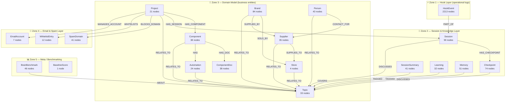

# HappySkies Neo4j Brain — Architecture Reference

**Purpose:** This document captures the intentional design of the Neo4j graph structure.  
It exists so that future sessions (and future recommendations from tools like `brain_benchmark.py`)  
are evaluated against *deliberate design decisions*, not just generic graph best-practices.

> ⚠️ **Before adding nodes, relationships, or acting on benchmark recommendations:**  
> Read this document. Some "low scores" are intentional. Some "missing links" should stay missing.

---

## Graph Zones

The graph is divided into five intentional zones. Each zone has a clear purpose and deliberate  
boundaries with the others.



---

## Zone Descriptions

### Zone 1 — Hook Layer
**Nodes:** `HookEvent`  
**Volume:** High (2000+ and growing — every Copilot message creates one)  
**Purpose:** Raw operational capture. Every user message is recorded here with metadata  
(timestamp, topic detection, source).

**Intentional constraint:** HookEvents connect ONLY to Sessions via `PART_OF`.  
They do NOT link to Topics, Projects, Components, or anything in the domain model.

**Why:** HookEvents are logs, not knowledge. Direct links to domain nodes would:
- Create thousands of low-quality relationships that dilute the graph
- Make it impossible to distinguish "we discussed this once" from "this is a core relationship"
- Pollute graph traversals (e.g. "what relates to suppliers?" would return every session message)

**Distillation path:** HookEvent → Session → Checkpoint/Learning/Summary → Topic  
This is intentional. Raw signal gets distilled through Session before reaching the domain model.

---

### Zone 2 — Session & Knowledge Layer
**Nodes:** `Session`, `Checkpoint`, `SessionSummary`, `Learning`, `Memory`  
**Purpose:** The bridge between raw capture and structured knowledge.

- `Session`: Groups HookEvents. Links to Topics via keyword detection (`DISCUSSES`)
- `Checkpoint`: Saved mid-session state. Also links to Topics (captured at save time)
- `SessionSummary`: AI-generated summary of a session. Links to the Topics it covered
- `Learning`: Manually curated insights. Must be added deliberately (not auto-extracted)
- `Memory`: Factual notes that persist across sessions

**Design note:** Learnings and Memories should be sparse and curated. Auto-extraction was  
disabled deliberately — low-quality auto-extracted nodes were found to be noise.

---

### Zone 3 — Domain Model
**Nodes:** `Project`, `Component`, `ComponentDoc`, `Automation`, `Brand`, `Supplier`,  
`Store`, `Person`, `Topic`  
**Purpose:** The structured business knowledge graph. This is the "real brain."

`Topic` is the **semantic hub** — most domain nodes link to Topics via `RELATES_TO`.  
This allows traversal like: "what's related to the `shipping` topic?" → Suppliers, Automations,  
Sessions, Learnings, all in one query.

**Hierarchy:**
```
Project
  └─ HAS_COMPONENT → Component
       └─ HAS_DOC → ComponentDoc
       └─ HAS → Automation
  └─ HAS_DISTRIBUTOR → Distributor
  └─ HAS_SESSION → Session
  └─ BLOCKS_DOMAIN → SpamDomain
  └─ MANAGES_ACCOUNT → EmailAccount

Brand → SOLD_BY → Store
Brand → SUPPLIED_BY → Supplier
Supplier → SUPPLIES_TO → Store
Person → CONTACT_FOR → Supplier
```

---

### Zone 4 — Email & Spam Layer
**Nodes:** `SpamDomain`, `SpamSender`, `WhitelistEntry`, `EmailAccount`, `EmailFolder`  
**Purpose:** Operational email infrastructure data. Blocklists, whitelists, IMAP accounts.

Attached to `Project` nodes (each store/project manages its own email accounts and rules).  
Not linked to Topics — this data is operational config, not conceptual knowledge.

---

### Zone 5 — Meta / Benchmarking
**Nodes:** `BrainBenchmark`, `ClaudeMdBenchmark`, `BaselineScore`  
**Purpose:** Tracks brain health scores over time. Used to measure improvement.

`BrainBenchmark` nodes link to Topics via `ABOUT` to record which topic a benchmark run  
focused on. These are **measurement nodes only** — they should never influence the graph structure.

---

## Design Principles

### 1. Separation of signal strength
Not all connections are equal. The graph uses zone separation to enforce quality:
- Zone 1 = raw signal (every message)
- Zone 2 = filtered signal (per-session, curated)
- Zone 3 = structured knowledge (deliberate, long-lived)

### 2. Topics are semantic, not operational
`Topic` nodes represent *concepts*, not entities. A `Supplier` node is an entity.  
The link `Supplier -[:RELATES_TO]-> Topic` says "this supplier is relevant to this domain."  
Topics should not be created for every noun — keep the topic list stable (~33 is the agreed cap).

### 3. Benchmark scores are not the goal
Some benchmark checks are generic (e.g. "rel/node ratio", "dependency links").  
The HappySkies graph is intentionally sparse in some areas because:
- HookEvents are excluded from the domain graph by design (inflates node count vs rel count)
- Not all entities need dependency links (small team, roles are known)
- Some "missing" links are actually correct absences

> When a benchmark check fails, first ask: *is this a real gap, or is it a deliberate design choice?*

### 4. Sparsity in Learnings and Tasks
- `Learning` nodes: curated only. Auto-extraction creates noise (proven and disabled).
- `Task` nodes: removed. Replaced by `Todo` nodes (manually managed).
- Quality over quantity. 30 good learnings >> 300 auto-extracted fragments.

### 5. The hook layer is append-only
HookEvents grow forever and that's fine. They are the audit log.  
Do not prune HookEvents to improve benchmarks. They exist for traceability, not graph aesthetics.

---

## What Intentionally Has No Links

| Missing link | Why it's intentional |
|---|---|
| HookEvent → Topic | HookEvents are logs. Topics are curated. Signal distilled via Session. |
| HookEvent → Project/Component | Same reason — would pollute domain traversals |
| Person → Task | Small team — roles are implicit, not graph-encoded |
| Automation → Automation (DEPENDS_ON) | Complex dependency chains not needed at current scale |
| SpamDomain → Topic | Operational data, not conceptual |
| BrainBenchmark → Session | Benchmarks measure the graph, they're not part of it |

---

## Current Counts (as of 2026-03-28)

| Label | Count |
|---|---|
| HookEvent | 2,213 |
| Brand | 84 |
| Session | 90 |
| Checkpoint | 74 |
| Supplier | 35 |
| Component | 38 |
| Person | 43 |
| Topic | 33 (capped) |
| Learning | 32 |
| Memory | 51 |
| Automation | 24 |
| Project | 21 |
| Todo | 3 |

**Total relationships:** ~4,100 across 34 relationship types  
**Benchmark score at time of writing:** ~69.7/100 (some checks deliberately not pursued)

---

## Recommended Reading Order for a New Session

1. Read this document (`NEO4J_ARCHITECTURE.md`)
2. Read `core_context.md` for current project state
3. Run `brain_benchmark.py` — but cross-reference each failing check against this doc
   before recommending fixes
