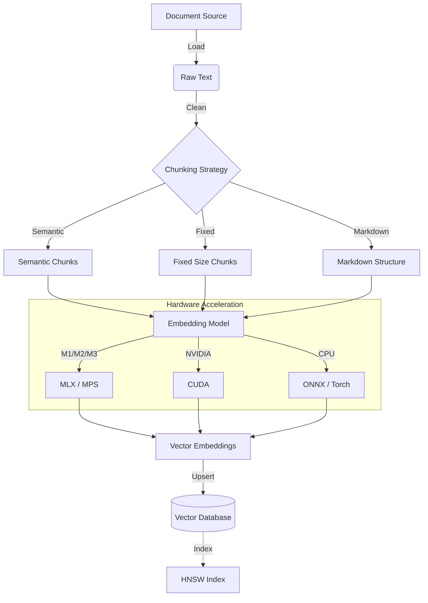
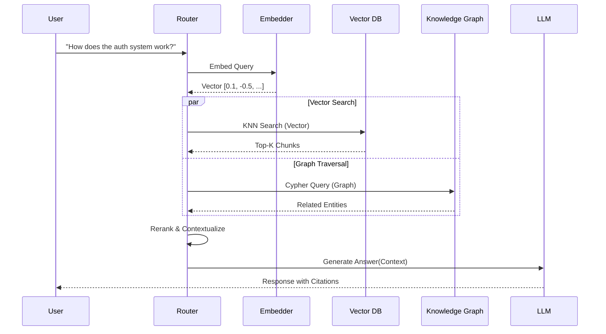
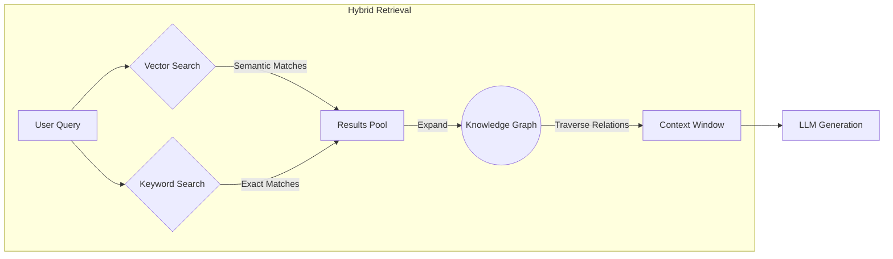

# 🔢 Vector Embeddings & Architecture

The Agentic Brain uses a sophisticated vector embedding pipeline designed for high-performance semantic search and retrieval. This architecture supports multiple backends, hardware acceleration strategies, and hybrid retrieval methods.

## 🏗️ Architecture Overview

The vector pipeline is built on a modular design that separates embedding generation, storage, and retrieval. This allows for flexible deployment across different hardware (Apple Silicon, NVIDIA GPUs) and vector stores (Neo4j, Pinecone).

### 🔄 Data Flow: Document to Vector

## 🧩 Component Details

### 1. Embedding Models
We support a variety of embedding providers to balance cost, speed, and quality:

| Provider | Type | Best For |
|----------|------|----------|
| **Sentence Transformers** | Local | General purpose, offline use, privacy |
| **OpenAI** | Cloud | High accuracy, large context windows |
| **Ollama** | Local | Running open-source models (Llama, Mistral) locally |
| **MLX** | Local | **Apple Silicon Optimized** - fastest on Mac |

### 2. Hardware Acceleration
The system automatically detects available hardware to accelerate embedding generation:

- **Apple Silicon (M-Series):** Uses `MLX` or `MPS` (Metal Performance Shaders) for near-instant embeddings.
- **NVIDIA GPUs:** Uses `CUDA` via PyTorch for high-throughput batch processing.
- **AMD GPUs:** Uses `ROCm` on Linux systems.
- **CPU:** optimized fallback using quantization if no GPU is available.

### 3. Vector Storage Backends
The `vectordb` module provides a unified interface for different vector stores:

- **Neo4j (Native):** Preferred for GraphRAG. Stores vectors on nodes to enable hybrid vector + graph traversal.
- **Pinecone:** Managed cloud vector database for massive scale.
- **Weaviate:** Open-source vector search engine.
- **Qdrant:** High-performance vector database.
- **Memory:** Ephemeral storage for testing and small sessions.

### 4. Chunking Strategies
Smart chunking is critical for retrieval quality. We implement several strategies in `rag.chunking`:

- **Fixed-Size:** Standard overlapping windows (e.g., 512 tokens with 50 overlap).
- **Semantic:** Splits text based on sentence boundaries and meaning.
- **Recursive:** Hierarchically splits by separators (\n\n, \n, " ", "") to fit context.
- **Markdown-Aware:** Respects headers, code blocks, and lists to preserve structure.

## 🔍 Retrieval Architecture

### Query Flow

### ⚡ Hybrid Search (Vector + Graph)

The most powerful feature is combining vector similarity with graph traversal (GraphRAG):

## 📊 Performance & Benchmarks

Performance varies significantly by hardware and model choice.

```mermaid
gantt
    title Embedding Generation Time (100 chunks)
    dateFormat X
    axisFormat %s
    
    section Apple M3 Max
    MLX (Native)      : 0, 1.2s
    PyTorch (MPS)     : 0, 2.5s
    
    section NVIDIA A100
    CUDA (Batch 32)   : 0, 0.8s
    
    section CPU (Intel i9)
    ONNX Runtime      : 0, 15s
    PyTorch CPU       : 0, 45s
```

*Note: Benchmarks are approximate and depend on model size (e.g., all-MiniLM-L6-v2 vs. e5-large).*
