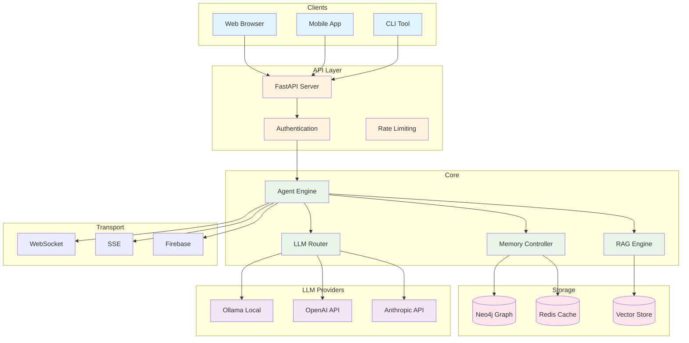
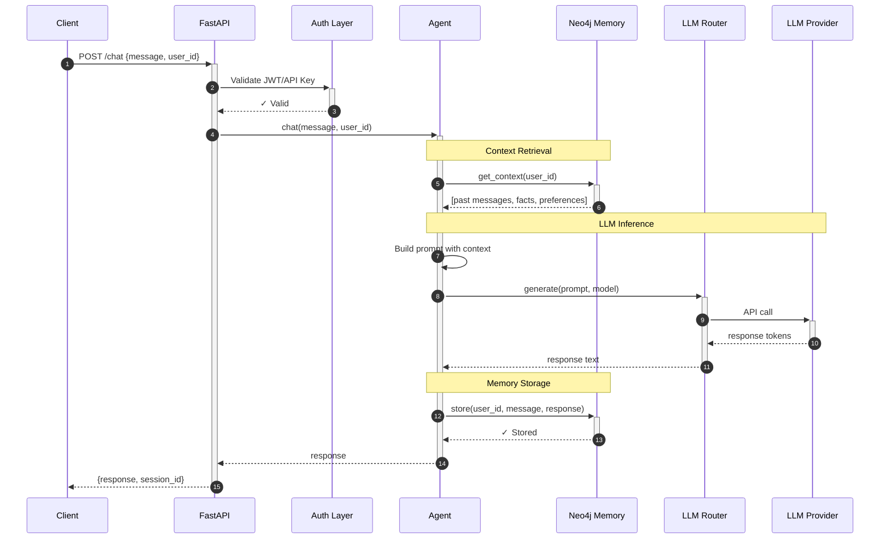
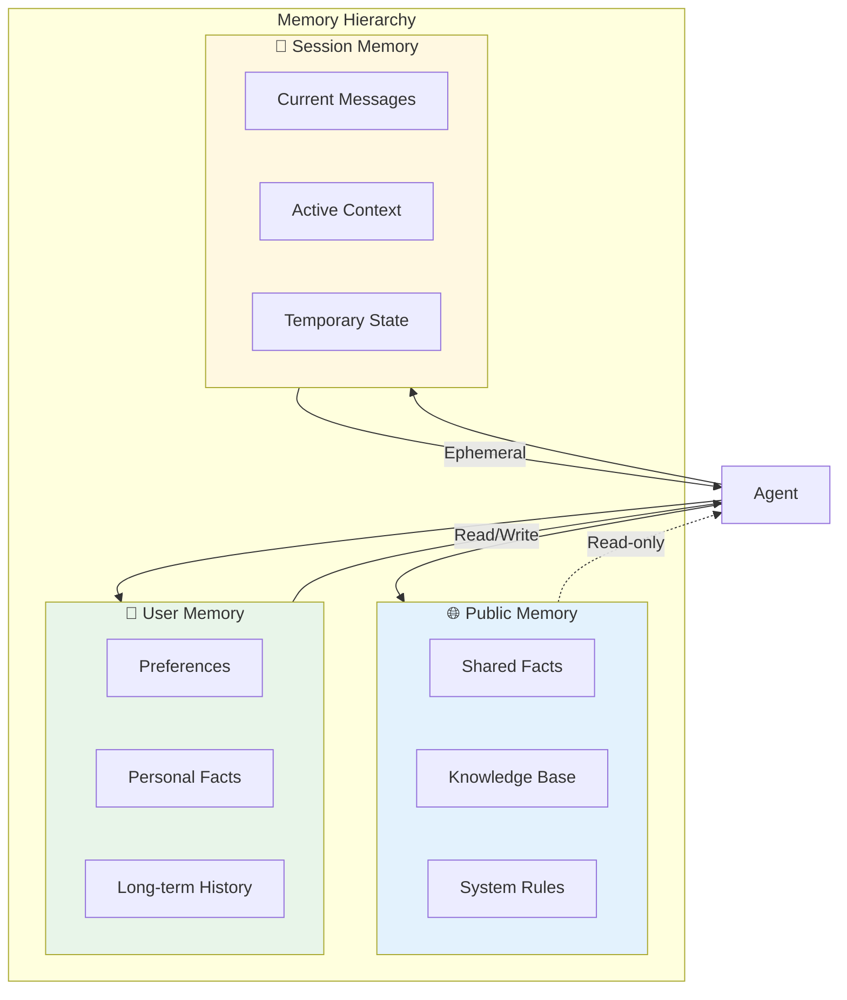
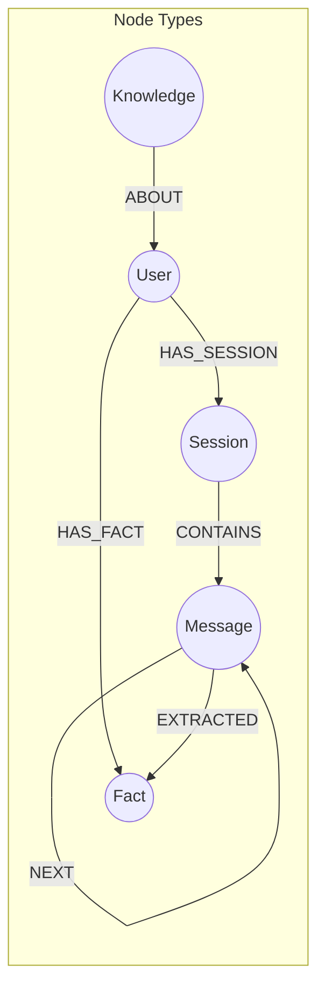
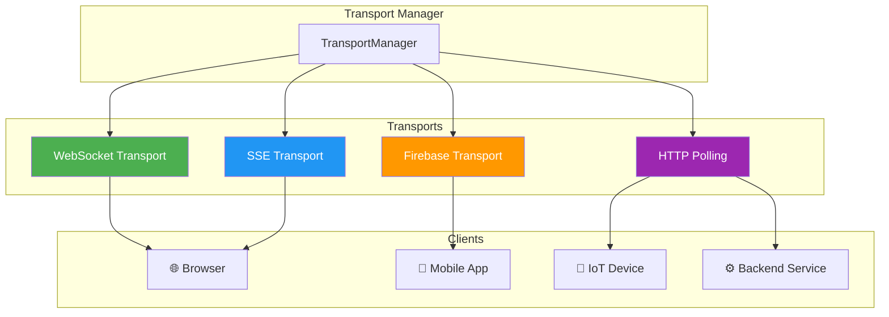
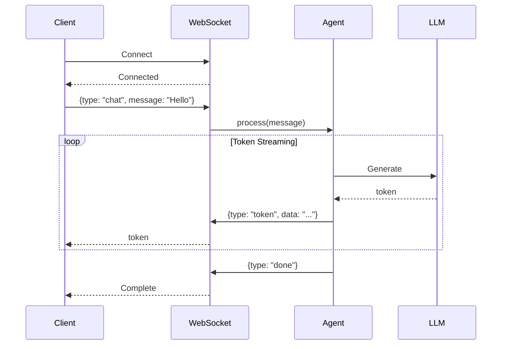
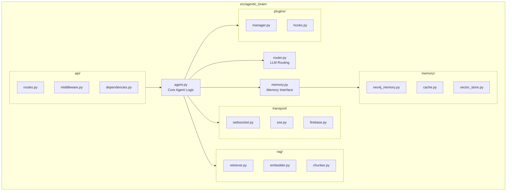
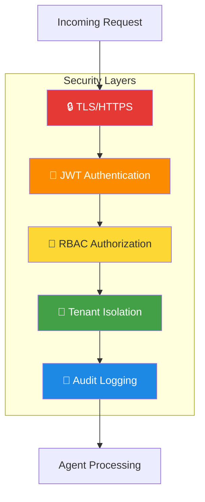
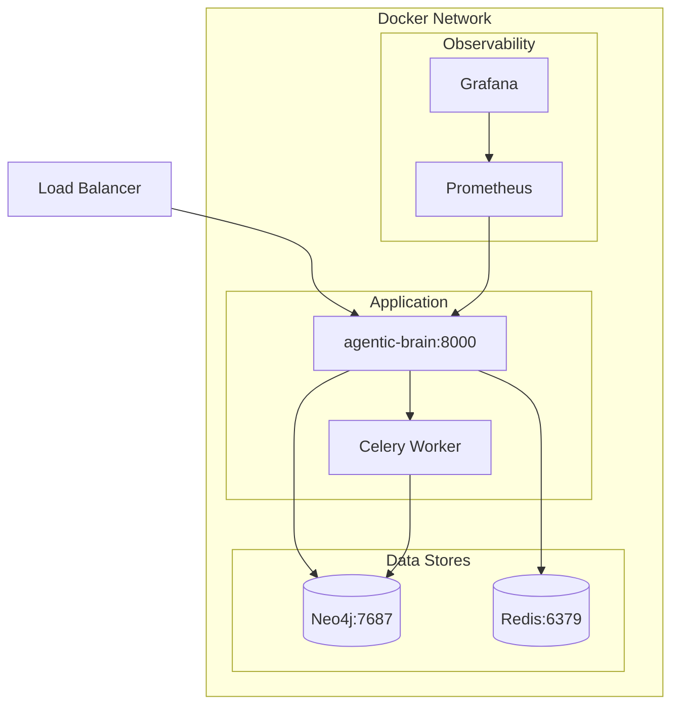
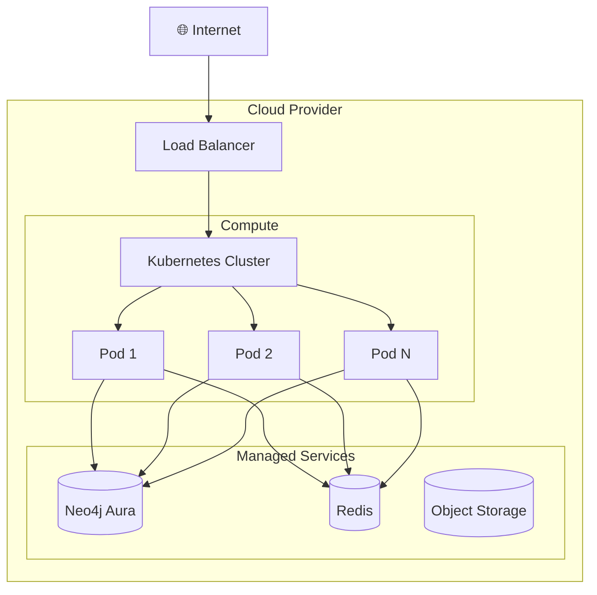

# Agentic Brain Architecture

**Complete system architecture documentation with diagrams.**

---

## 📐 High-Level Architecture

The Agentic Brain is built as a layered system with clear separation of concerns:



---

## 🔄 Request Flow

Every chat request follows this sequence:



---

## 🧠 Memory Architecture

### Memory Scopes

The brain supports three levels of memory isolation:



### Neo4j Graph Schema



---

## 🚀 Transport Layer

Real-time communication across different client types:



### Streaming Sequence



---

## 📦 Module Structure



---

## 🔐 Security Architecture



---

## 🏗️ Deployment Architecture

### Docker Compose Stack



### Production Architecture



---

## 📊 Data Flow Summary

```
┌─────────────┐     ┌─────────────┐     ┌─────────────┐
│   Client    │────▶│  FastAPI    │────▶│   Agent     │
└─────────────┘     └─────────────┘     └──────┬──────┘
                                               │
                    ┌──────────────────────────┼──────────────────────────┐
                    │                          │                          │
              ┌─────▼─────┐            ┌───────▼───────┐          ┌───────▼───────┐
              │  Router   │            │    Memory     │          │   Transport   │
              └─────┬─────┘            └───────┬───────┘          └───────┬───────┘
                    │                          │                          │
         ┌──────────┼──────────┐               │                 ┌────────┼────────┐
         │          │          │               │                 │        │        │
    ┌────▼────┐ ┌───▼───┐ ┌────▼────┐    ┌─────▼─────┐     ┌─────▼────┐ ┌─▼──┐ ┌───▼────┐
    │ Ollama  │ │OpenAI │ │Anthropic│    │   Neo4j   │     │WebSocket │ │SSE │ │Firebase│
    └─────────┘ └───────┘ └─────────┘    └───────────┘     └──────────┘ └────┘ └────────┘
```

---

## 🔗 Key Interfaces

### Agent Interface

```python
class Agent:
    def chat(message: str, user_id: str, **kwargs) -> str
    def stream(message: str, user_id: str) -> AsyncIterator[str]
    def get_context(user_id: str) -> List[Message]
    def store_fact(user_id: str, fact: str) -> None
```

### Memory Interface

```python
class Memory(Protocol):
    async def get_context(user_id: str, limit: int) -> List[Message]
    async def store_message(user_id: str, role: str, content: str) -> None
    async def get_facts(user_id: str) -> List[Fact]
    async def store_fact(user_id: str, fact: Fact) -> None
```

### Router Interface

```python
class LLMRouter:
    # Core methods
    async def generate(prompt: str, model: str = None) -> str
    async def stream(prompt: str, model: str = None) -> AsyncIterator[str]
    def available_models() -> List[str]
    
    # Provider health
    async def check_all_providers() -> dict  # Health status of all providers
    
    # HTTP pooling
    async def start_http_pool() -> None      # Manual pool start (auto-starts on use)
    async def stop_http_pool() -> None
    def get_pool_stats() -> dict             # Pool metrics
    
    # Token tracking
    def get_token_stats() -> dict            # Usage by provider
    def reset_token_stats() -> None
    
    # Context manager support
    async with LLMRouter() as router:
        await router.generate(...)           # Pool auto-managed
```

**Per-Provider Timeouts:**
| Provider | Default Timeout | Reason |
|----------|----------------|--------|
| Ollama | 120s | Local models slow on first load |
| Anthropic | 90s | Claude can be slower |
| OpenAI | 60s | Generally fast |
| OpenRouter | 60s | Multiple backends |

**HTTP Connection Pooling:**
- Pool enabled by default (`use_http_pool=True`)
- Auto-starts on first request (lazy initialization)
- Reuses keep-alive connections (~50ms → ~1ms connection setup)
- Automatic retries with circuit breaker
- Falls back to direct sessions if pool unavailable

---

## 📚 Related Documentation

- **[Getting Started](./getting-started.md)** — Quick start guide
- **[API Reference](./api/)** — Complete API documentation
- **[Streaming](./STREAMING.md)** — Real-time response streaming
- **[Plugins](./plugins.md)** — Extending functionality
- **[Security](./SECURITY.md)** — Security best practices

---

*Last updated: 2026-03-21*
