# Agentic Brain Architecture

<div align="center">

[](./ARCHITECTURE.md)
[](../SECURITY.md)
[](../RAG.md)

**Enterprise-Grade AI Infrastructure · Multi-LLM Orchestration · Graph-Enhanced RAG**

*A comprehensive technical reference for the Agentic Brain architecture.*

</div>

---

## 📋 Table of Contents

- [System Overview](#1-system-overview)
- [Component Architecture](#2-component-architecture)
- [LLM Routing Flow](#3-llm-routing-flow)
- [RAG Pipeline](#4-rag-pipeline)
- [Security Postures](#5-security-postures)
- [Data Flow](#6-data-flow)
- [Deployment Topologies](#7-deployment-topologies)
- [API Architecture](#8-api-architecture)
- [Memory System](#9-memory-system)
- [Technology Stack](#10-technology-stack)

---

## 1. System Overview

For the Neo4j-specific reference model used by GraphRAG and memory, see [Neo4j Architecture](../NEO4J_ARCHITECTURE.md) and [Neo4j Zones](../NEO4J_ZONES.md).

Agentic Brain is a **production-ready AI orchestration platform** that combines multi-LLM routing, graph-enhanced RAG, and enterprise security. The architecture follows a modular, microservices-friendly design that can scale from single-node deployments to distributed clusters.

<div align="center">
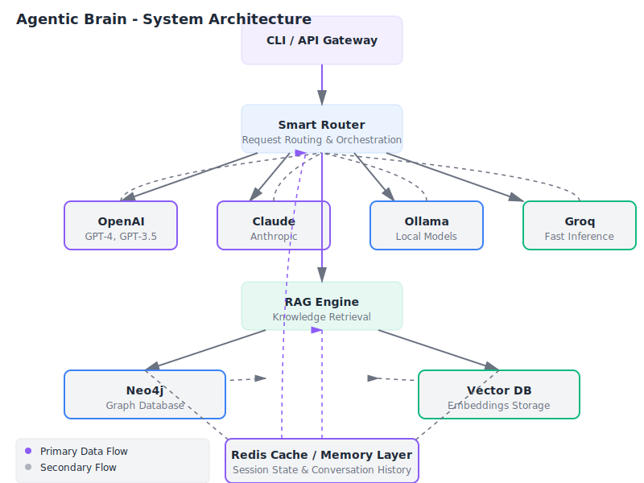

*High-level system architecture diagram*
</div>

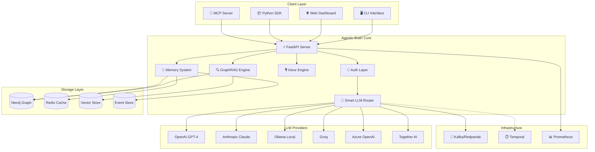

### Key Design Principles

| Principle | Implementation |
|-----------|----------------|
| **Modularity** | Each component is independently deployable and testable |
| **Resilience** | Automatic failover, circuit breakers, retry policies |
| **Observability** | Structured logging, distributed tracing, metrics |
| **Security First** | Zero-trust architecture, encryption everywhere |
| **Hardware Acceleration** | Native support for Apple Silicon (MLX), NVIDIA CUDA, AMD ROCm |

---

## 2. Component Architecture

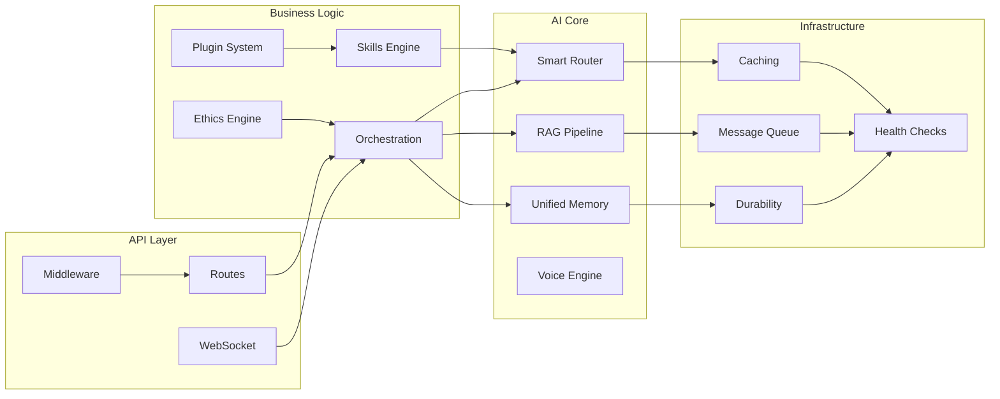

### Core Modules

| Module | Location | Purpose |
|--------|----------|---------|
| `api/` | `src/agentic_brain/api/` | FastAPI routes, middleware, WebSocket |
| `router/` | `src/agentic_brain/router/` | Smart LLM routing with 10+ providers |
| `rag/` | `src/agentic_brain/rag/` | GraphRAG with 54+ document loaders |
| `memory/` | `src/agentic_brain/memory/` | Unified memory with Neo4j backend |
| `voice/` | `src/agentic_brain/voice/` | Multi-voice TTS with regional support |
| `auth/` | `src/agentic_brain/auth/` | OAuth2, SAML, API keys, RBAC |
| `skills/` | `src/agentic_brain/skills/` | Extensible skill system |
| `durability/` | `src/agentic_brain/durability/` | Event sourcing, task queues |

---

## 3. LLM Routing Flow

The **SmartRouter** implements intelligent multi-LLM orchestration with four primary modes:

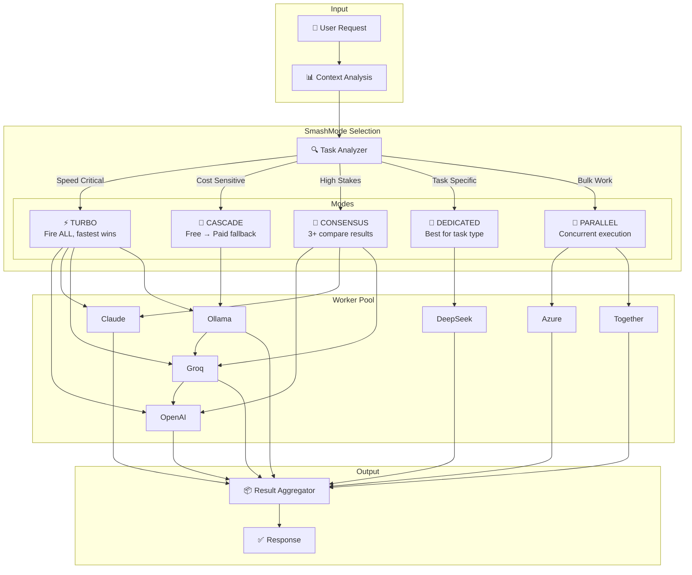

### SmashMode Details

| Mode | Use Case | Behavior | Cost |
|------|----------|----------|------|
| **TURBO** | Speed critical | Fire all workers simultaneously, return fastest | High |
| **CASCADE** | Cost optimization | Try free (Ollama) → cheap (Groq) → premium (OpenAI) | Low |
| **CONSENSUS** | High-stakes decisions | Query 3+ LLMs, compare/vote on results | Medium |
| **DEDICATED** | Task-specific routing | Route to best model for task type | Variable |
| **PARALLEL** | Bulk processing | Distribute work across workers | Medium |

### Task-to-Model Routing

```python
TASK_ROUTES = {
    "code": ["openai", "azure_openai", "groq", "local"],
    "fast": ["groq", "gemini", "local"],
    "free": ["gemini", "groq", "local", "together"],
    "bulk": ["local", "together", "groq"],
    "complex": ["openai", "deepseek", "groq"],
    "creative": ["openai", "gemini", "groq"],
}
```

---

## 4. RAG Pipeline

The **GraphRAG Engine** combines vector similarity search with knowledge graph traversal for superior retrieval accuracy.

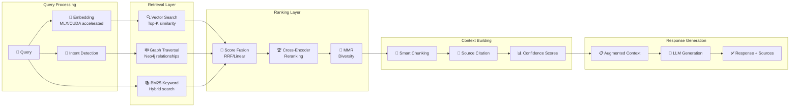

### RAG Features

| Feature | Description |
|---------|-------------|
| **Hardware Acceleration** | MLX (Apple M1-M4), CUDA (NVIDIA), ROCm (AMD) |
| **Chunking Strategies** | Fixed, Semantic, Recursive, Markdown-aware |
| **Hybrid Search** | Vector + BM25 keyword with RRF fusion |
| **Reranking** | Cross-encoder, MMR for diversity |
| **54+ Loaders** | Google Drive, Gmail, S3, Confluence, Notion, Slack... |
| **Graph Enhancement** | Neo4j relationship traversal for contextual depth |

### Embedding Pipeline

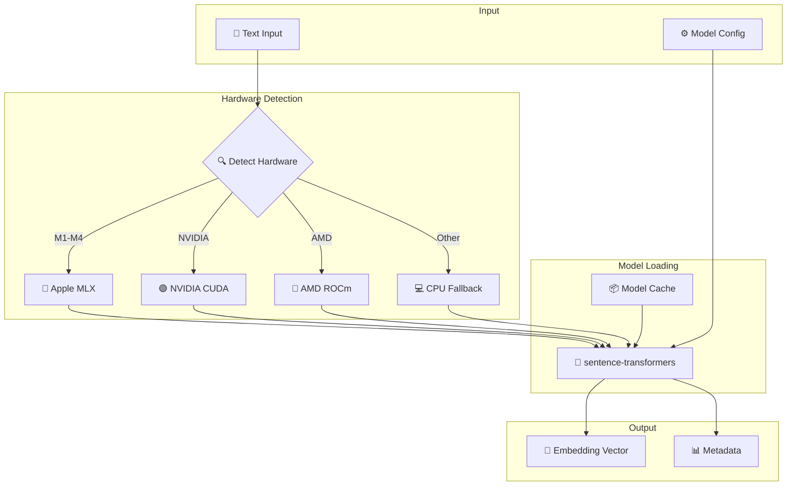

---

## 5. Security Postures

Agentic Brain supports **six security postures** ranging from open consumer use to classified government operations.

```mermaid
graph TB
    subgraph "Security Postures"
        direction TB
        
        Consumer[🏠 CONSUMER<br/>Open, minimal restrictions]
        Professional[💼 PROFESSIONAL<br/>Standard business security]
        Enterprise[🏢 ENTERPRISE<br/>Corporate compliance]
        Defense[🛡️ DEFENSE<br/>Government contractor]
        TopSecret[🔒 TOP SECRET<br/>Classified operations]
        SCIF[🏛️ SCIF<br/>Air-gapped, no external APIs]
    end
    
    Consumer --> Professional
    Professional --> Enterprise
    Enterprise --> Defense
    Defense --> TopSecret
    TopSecret --> SCIF
    
    style Consumer fill:#10B981
    style Professional fill:#3B82F6
    style Enterprise fill:#8B5CF6
    style Defense fill:#F59E0B
    style TopSecret fill:#EF4444
    style SCIF fill:#1F2937
```

### Posture Comparison Matrix

| Posture | External APIs | Logging | PII Handling | LLM Workers | Auth Level |
|---------|---------------|---------|--------------|-------------|------------|
| **Consumer** | ✅ All | Minimal | Basic redaction | All | API Key |
| **Professional** | ✅ Approved | Standard | Enhanced redaction | Approved | OAuth2 |
| **Enterprise** | ⚠️ Vetted only | Full audit | Field-level encryption | Enterprise tier | SAML/SSO |
| **Defense** | ⚠️ FedRAMP only | Immutable logs | E2E encryption | FedRAMP certified | CAC/PIV |
| **Top Secret** | ❌ Gov cloud only | Air-gapped logs | HSM encryption | Classified only | MFA + biometric |
| **SCIF** | ❌ None | Local only | Full isolation | Local only | Physical + MFA |

### Security Configuration

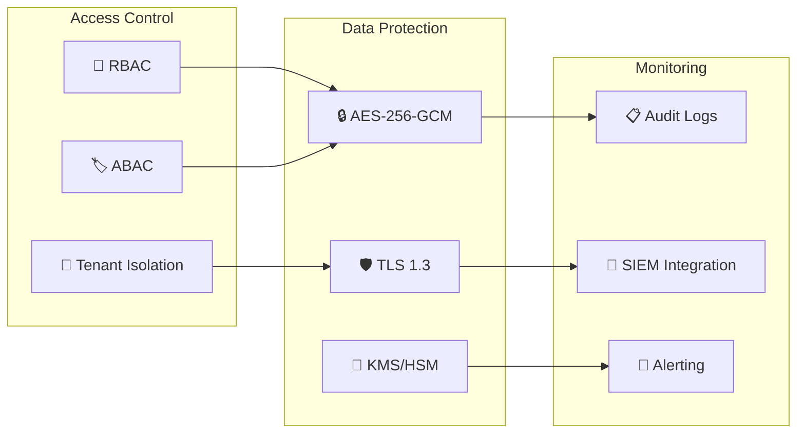

---

## 6. Data Flow

Complete request lifecycle from client to response:

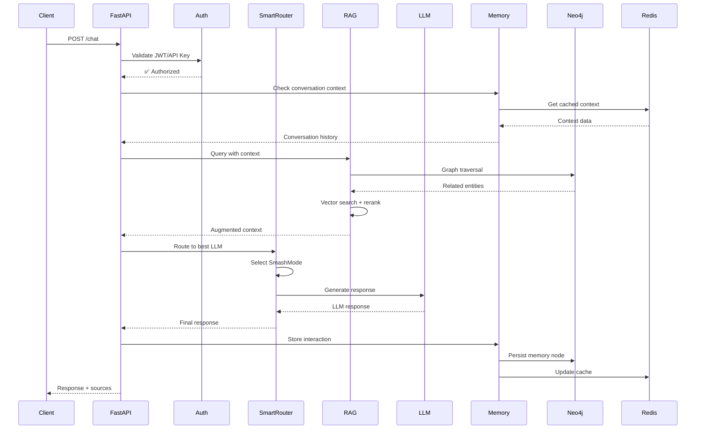

### Event Flow

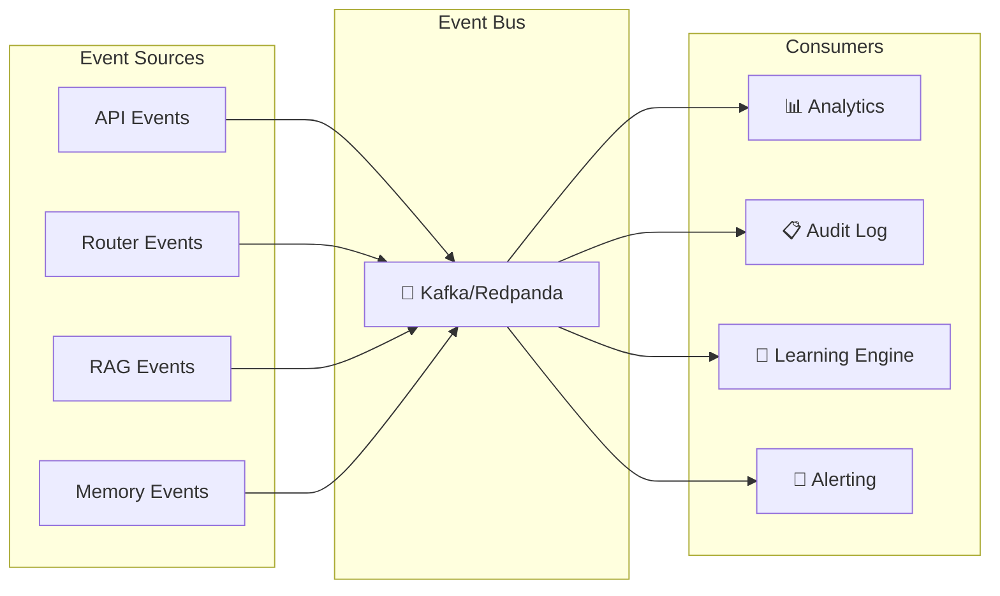

---

## 7. Deployment Topologies

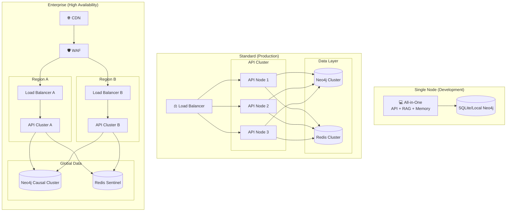

### Deployment Options

| Platform | Configuration | Best For |
|----------|--------------|----------|
| **Docker Compose** | Single YAML, all services | Development, small teams |
| **Kubernetes** | Helm charts, horizontal scaling | Production, enterprise |
| **Fly.io** | Edge deployment, global | Distributed workloads |
| **Railway** | Zero-config deployment | Rapid prototyping |
| **AWS/GCP/Azure** | Full cloud native | Enterprise scale |

---

## 8. API Architecture

```mermaid
graph TB
    subgraph "API Routes"
        Chat[/chat]
        RAGRoute[/rag]
        Memory[/memory]
        Voice[/voice]
        Admin[/admin]
        Health[/health]
    end
    
    subgraph "Middleware Stack"
        CORS[CORS]
        RateLimit[Rate Limiting]
        AuthMW[Authentication]
        Audit[Audit Logging]
        Compress[Compression]
    end
    
    subgraph "WebSocket"
        WSChat[/ws/chat]
        WSVoice[/ws/voice]
        WSStatus[/ws/status]
    end
    
    Request[📥 Request] --> CORS
    CORS --> RateLimit
    RateLimit --> AuthMW
    AuthMW --> Audit
    Audit --> Compress
    
    Compress --> Chat & RAGRoute & Memory & Voice & Admin & Health
    Compress --> WSChat & WSVoice & WSStatus
```

### Endpoints Overview

| Endpoint | Method | Description |
|----------|--------|-------------|
| `/chat` | POST | Main chat interface with streaming |
| `/rag/query` | POST | Direct RAG queries |
| `/rag/ingest` | POST | Ingest documents |
| `/memory/search` | POST | Search memory |
| `/voice/synthesize` | POST | Text-to-speech |
| `/admin/modes` | GET/PUT | Mode configuration |
| `/health` | GET | Health checks |
| `/ws/chat` | WebSocket | Real-time chat |

---

## 9. Memory System

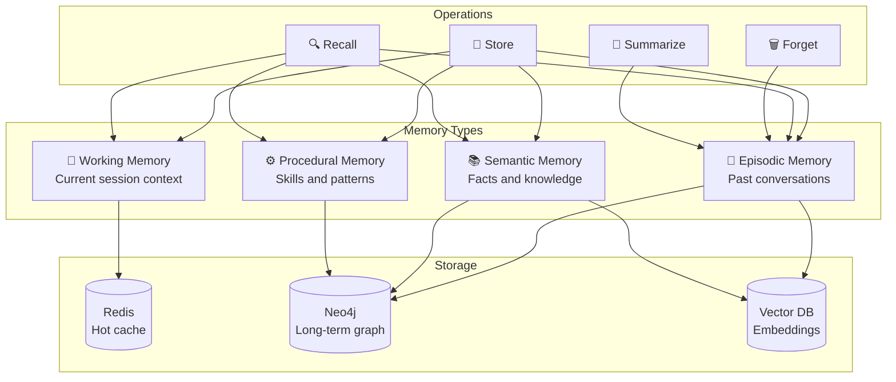

### Memory Node Schema (Neo4j)

```cypher
// Memory node
(:Memory {
    id: string,
    content: string,
    embedding: list<float>,
    timestamp: datetime,
    type: "episodic" | "semantic" | "procedural",
    importance: float,
    access_count: int,
    last_accessed: datetime
})

// Relationships
(:Memory)-[:FOLLOWS]->(:Memory)
(:Memory)-[:REFERENCES]->(:Entity)
(:Memory)-[:PART_OF]->(:Session)
```

---

## 10. Technology Stack

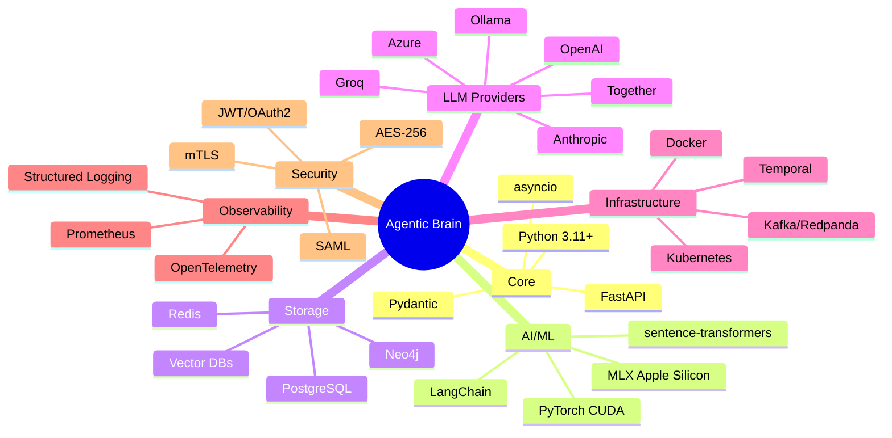

### Key Dependencies

| Category | Technology | Purpose |
|----------|------------|---------|
| **Web Framework** | FastAPI | Async HTTP/WebSocket server |
| **Validation** | Pydantic | Data validation and serialization |
| **Graph Database** | Neo4j | Knowledge graph and memory |
| **Cache** | Redis | Session cache and rate limiting |
| **Embeddings** | sentence-transformers | Vector embeddings |
| **Streaming** | Kafka/Redpanda | Event streaming |
| **Workflow** | Temporal | Durable workflows |
| **Monitoring** | Prometheus | Metrics collection |
| **Tracing** | OpenTelemetry | Distributed tracing |

---

## Quick Reference

### Environment Variables

```bash
# Core
AGENTIC_BRAIN_MODE=professional
AGENTIC_BRAIN_LOG_LEVEL=info

# LLM Providers
OPENAI_API_KEY=sk-...
ANTHROPIC_API_KEY=sk-ant-...
GROQ_API_KEY=gsk_...

# Storage
NEO4J_URI=bolt://localhost:7687
REDIS_URL=redis://localhost:6379

# Security
JWT_SECRET=your-secret-key
API_KEY_SALT=your-salt
```

### CLI Commands

```bash
# Start server
agentic-brain serve --mode professional

# Check health
agentic-brain health

# Switch mode
agentic-brain mode set enterprise

# Run RAG query
agentic-brain rag query "How do I deploy?"
```

---

## Further Reading

- [RAG Pipeline Guide](../RAG.md)
- [Security Documentation](../SECURITY.md)
- [LLM Provider Guide](../LLM_PROVIDERS.md)
- [Memory System](../MEMORY.md)
- [Voice Integration](../VOICE_INTEGRATION_GUIDE.md)
- [Deployment Guide](../DEPLOYMENT.md)

---

<div align="center">

**Built with 💜 by Agentic Brain Contributors**

*Part of the Brain ecosystem*

</div>
