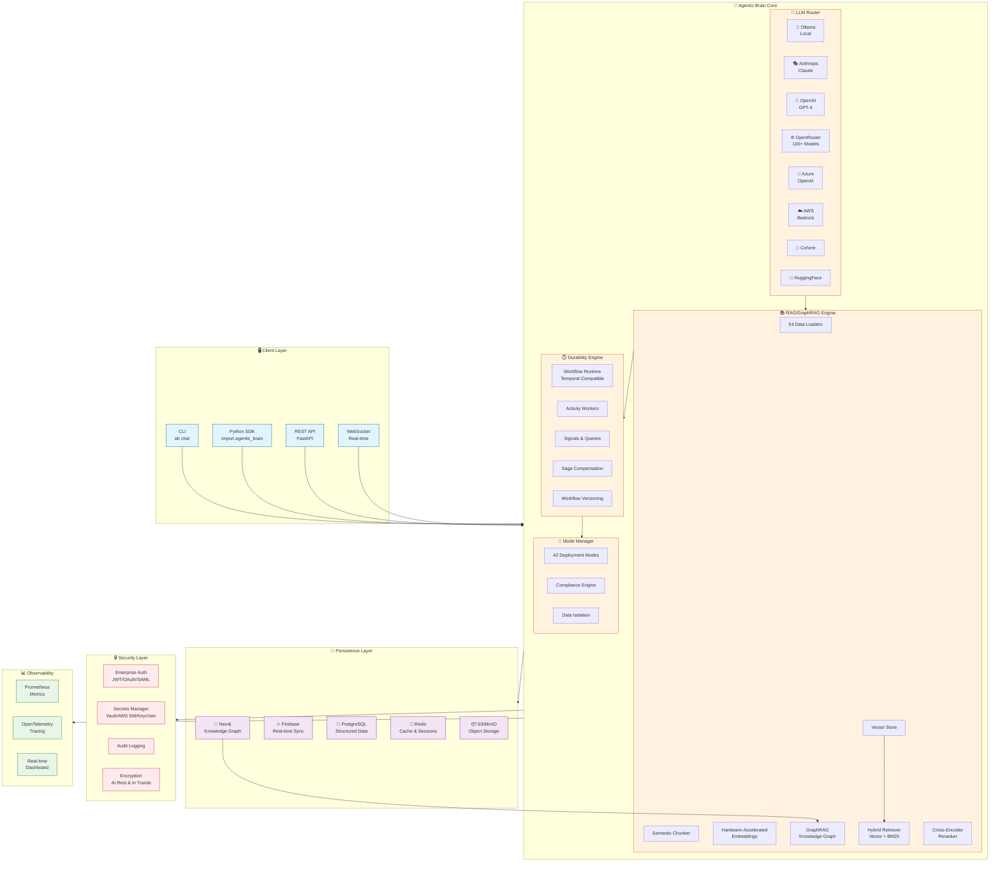
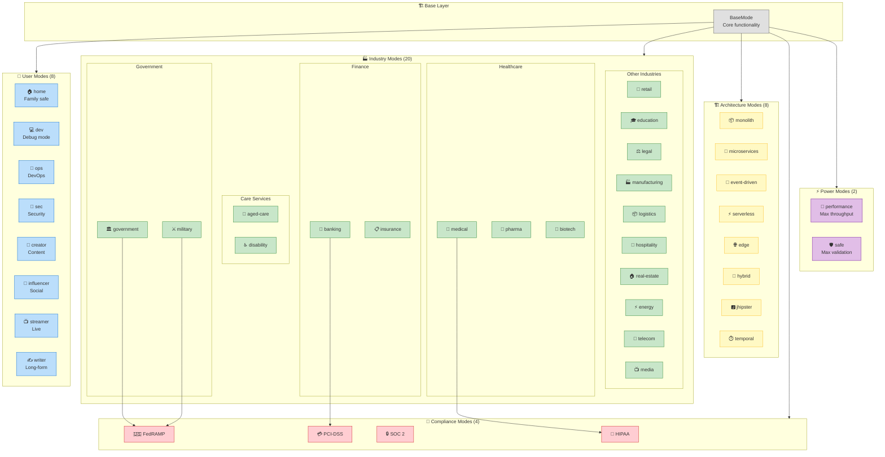
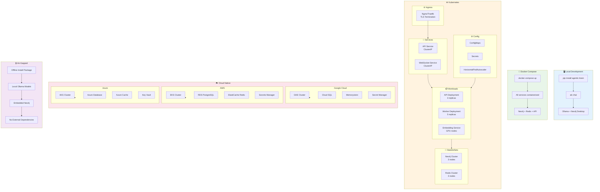
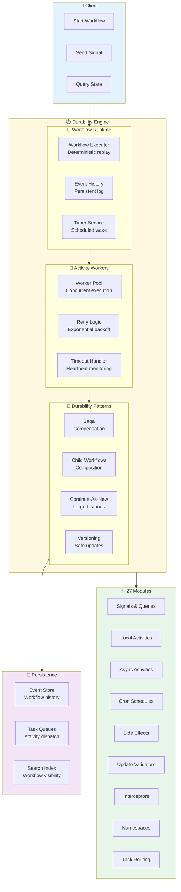
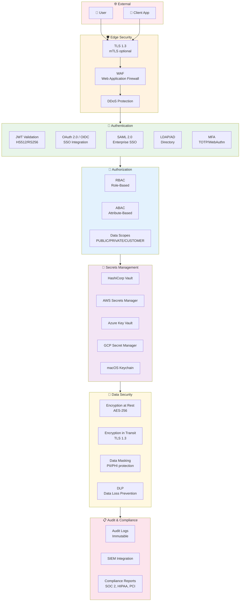
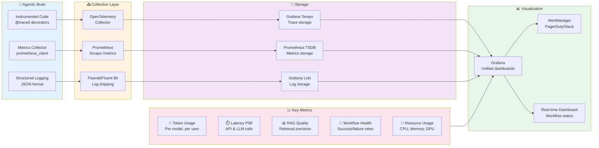
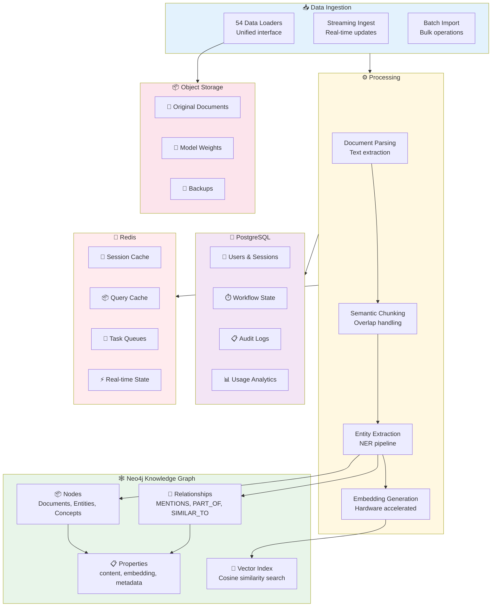
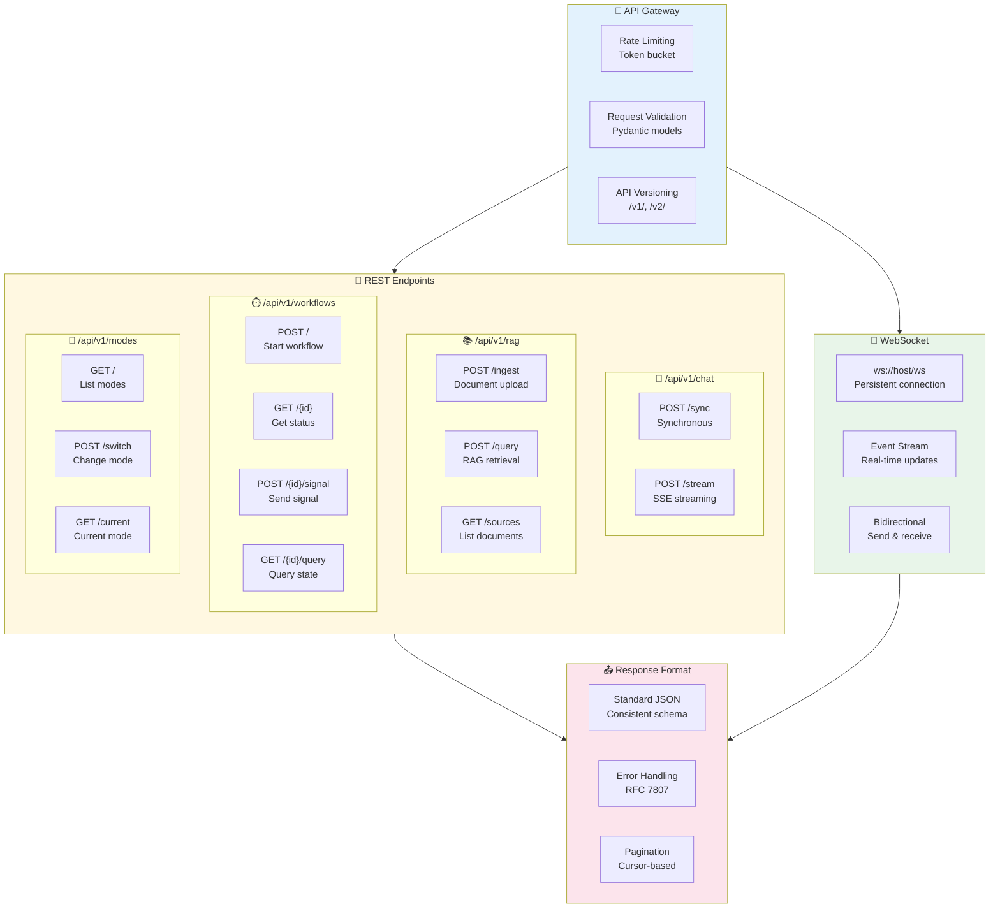

# 🧠 Agentic Brain Architecture Diagrams

> Professional architecture documentation for enterprise evaluation

---

## 📐 System Overview

High-level view of the Agentic Brain architecture showing all major components and their interactions.

---

## 📊 RAG Pipeline Architecture

Detailed view of how data flows through the RAG (Retrieval Augmented Generation) system.

```mermaid
flowchart LR
    subgraph Sources["📥 Data Sources (54 Loaders)"]
        direction TB
        S1["📁 Files<br/>PDF, DOCX, MD, TXT"]
        S2["☁️ Cloud<br/>Drive, SharePoint, S3"]
        S3["💬 Comms<br/>Slack, Teams, Discord"]
        S4["🎫 CRM<br/>Salesforce, HubSpot"]
        S5["🔧 Dev<br/>GitHub, Jira, Notion"]
        S6["💰 Finance<br/>Stripe, Xero, QB"]
    end

    subgraph Processing["⚙️ Processing Pipeline"]
        direction TB
        P1["📄 Document Parsing<br/>Extract text & metadata"]
        P2["✂️ Semantic Chunking<br/>Context-aware splitting"]
        P3["🔗 Entity Extraction<br/>NER + Relationship"]
        P4["📐 Embedding Generation<br/>M1/M2/CUDA accelerated"]
    end

    subgraph Storage["💾 Dual Storage"]
        direction TB
        V1["🔢 Vector Index<br/>HNSW / IVF"]
        G1["🕸️ Knowledge Graph<br/>Neo4j GraphRAG"]
    end

    subgraph Retrieval["🔍 Hybrid Retrieval"]
        direction TB
        R1["📊 Vector Search<br/>Semantic similarity"]
        R2["📝 BM25 Keyword<br/>Term matching"]
        R3["🕸️ Graph Traversal<br/>Relationship paths"]
        R4["🎯 Reciprocal Rank Fusion<br/>Score combination"]
    end

    subgraph Ranking["⭐ Reranking"]
        direction TB
        RR1["🔬 Cross-Encoder<br/>Pairwise scoring"]
        RR2["📍 Citation Mapping<br/>Source tracking"]
        RR3["📈 Confidence Scoring<br/>0.0 - 1.0"]
    end

    subgraph Generation["🤖 LLM Generation"]
        direction TB
        L1["📋 Prompt Assembly<br/>Context + Query"]
        L2["🧠 LLM Inference<br/>8 Providers"]
        L3["✅ Response + Citations<br/>Grounded output"]
    end

    Sources --> P1
    P1 --> P2
    P2 --> P3
    P3 --> P4

    P4 --> V1
    P3 --> G1

    V1 --> R1
    G1 --> R3
    R1 --> R4
    R2 --> R4
    R3 --> R4

    R4 --> RR1
    RR1 --> RR2
    RR2 --> RR3

    RR3 --> L1
    L1 --> L2
    L2 --> L3

    style Sources fill:#e3f2fd
    style Processing fill:#fff8e1
    style Storage fill:#f3e5f5
    style Retrieval fill:#e8f5e9
    style Ranking fill:#fff3e0
    style Generation fill:#fce4ec
```

---

## 🎯 Mode System Hierarchy

The 42 deployment modes organized by category, showing inheritance and specialization.

---

## 🚀 Deployment Architecture

Shows the various deployment options from local development to cloud-native Kubernetes.

---

## ⏱️ Durability Engine Architecture

Temporal-compatible workflow execution engine with 27 durability modules.

---

## 🔒 Security Architecture

Enterprise security controls and compliance boundaries.

---

## 📊 Observability Stack

Comprehensive monitoring, logging, and tracing architecture.

---

## 🗄️ Data Architecture

How data flows and is stored across the system.

---

## 🔌 API Architecture

RESTful and WebSocket API design patterns.

---

## Quick Reference

| Diagram | Purpose | Key Insights |
|---------|---------|--------------|
| [System Overview](#-system-overview) | High-level architecture | 8 LLM providers, 5 layers |
| [RAG Pipeline](#-rag-pipeline-architecture) | Data flow | 54 loaders → Neo4j → LLM |
| [Mode System](#-mode-system-hierarchy) | 42 modes | 5 categories, compliance inheritance |
| [Deployment](#-deployment-architecture) | Deployment options | Local → Docker → K8s → Cloud |
| [Durability](#️-durability-engine-architecture) | Workflow engine | 27 modules, Temporal compatible |
| [Security](#-security-architecture) | Enterprise security | Auth/Authz/Encryption/Audit |
| [Observability](#-observability-stack) | Monitoring | OpenTelemetry + Prometheus + Grafana |
| [Data](#️-data-architecture) | Data storage | Neo4j + PostgreSQL + Redis |
| [API](#-api-architecture) | API design | REST + WebSocket + Versioning |

---

**[← Back to README](../../README.md)** · **[Integrations →](./INTEGRATIONS.md)**

*These diagrams render natively on GitHub. No external tools required.*

