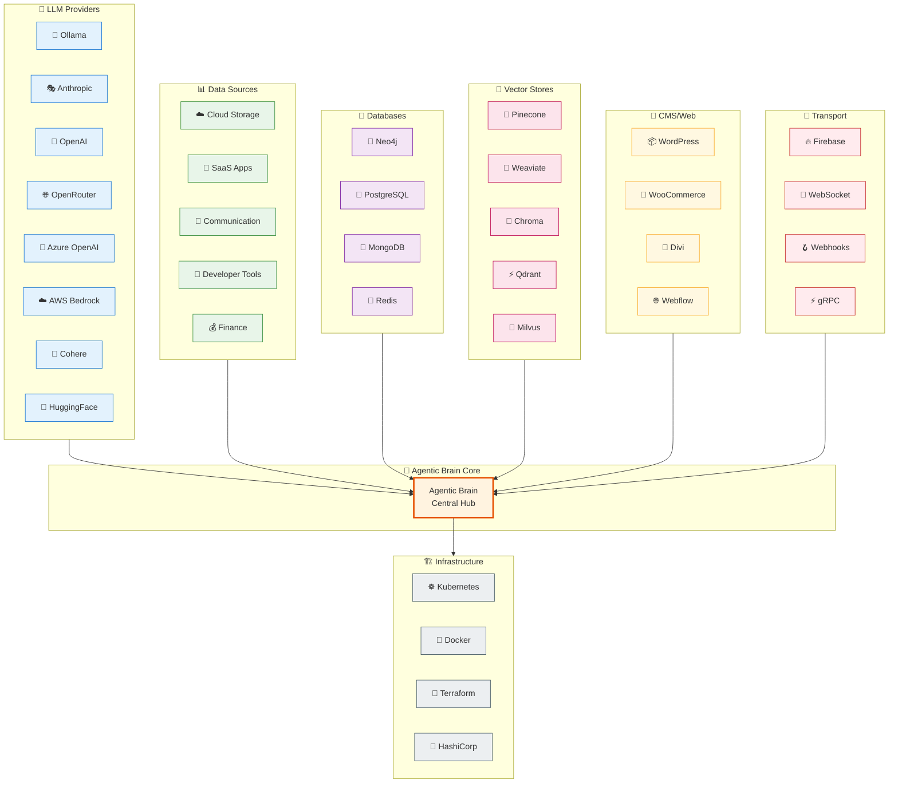
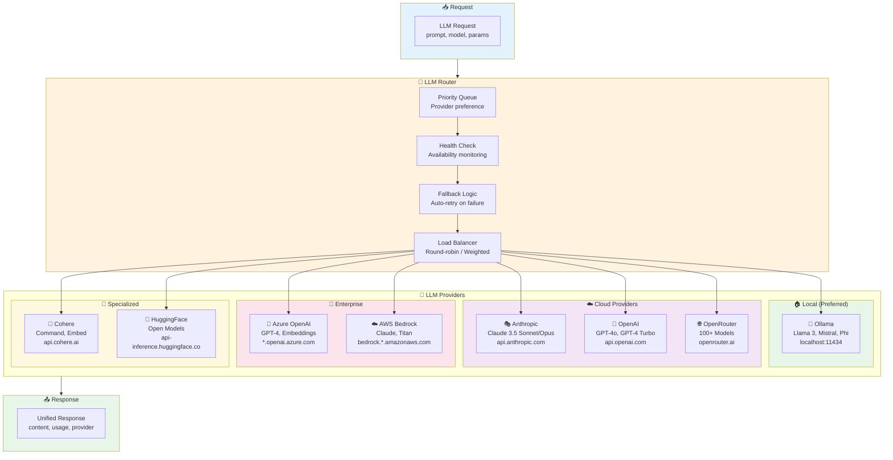
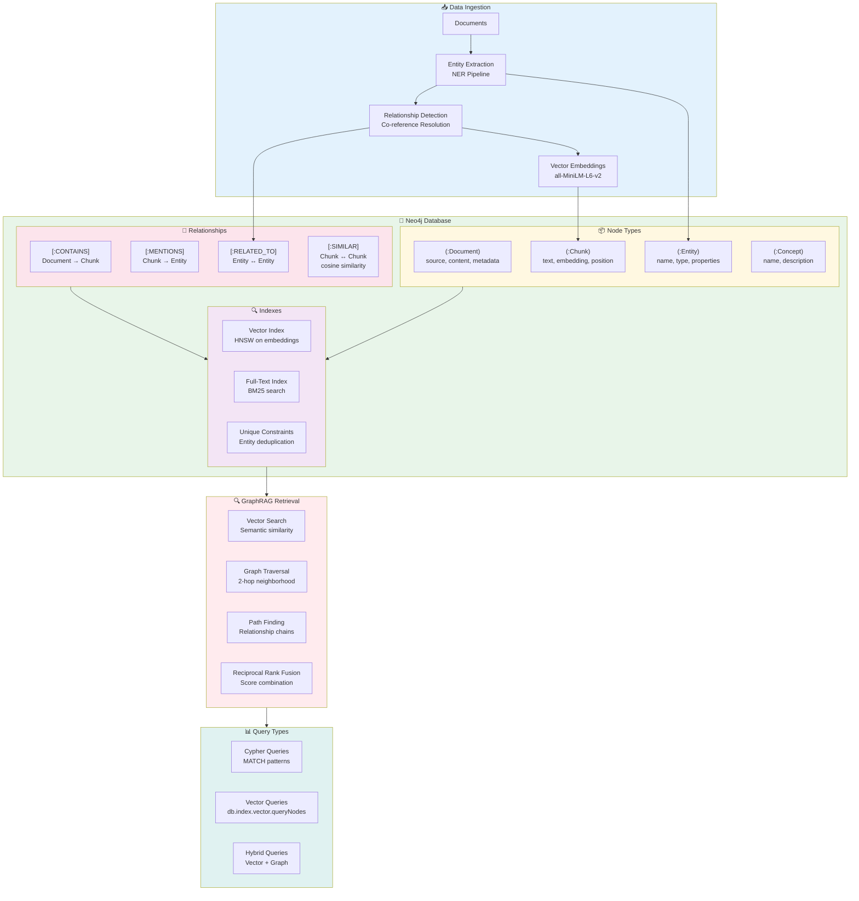
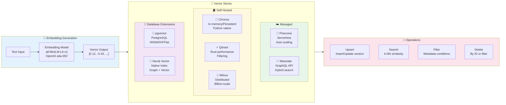
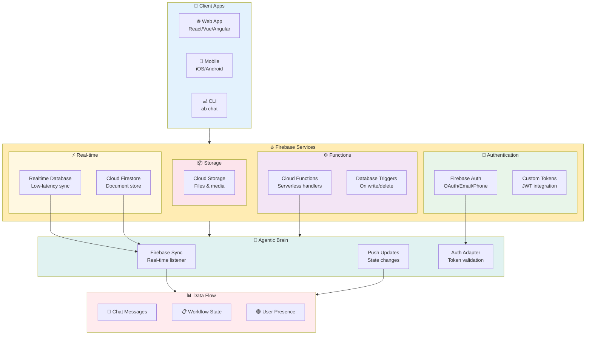
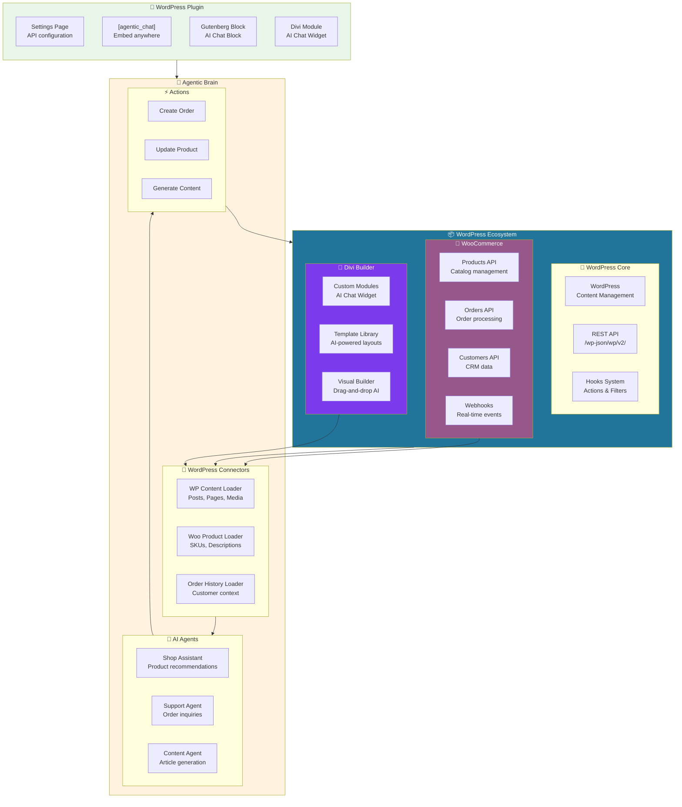
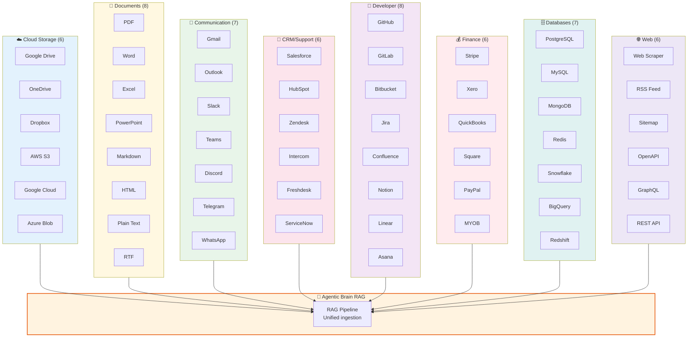
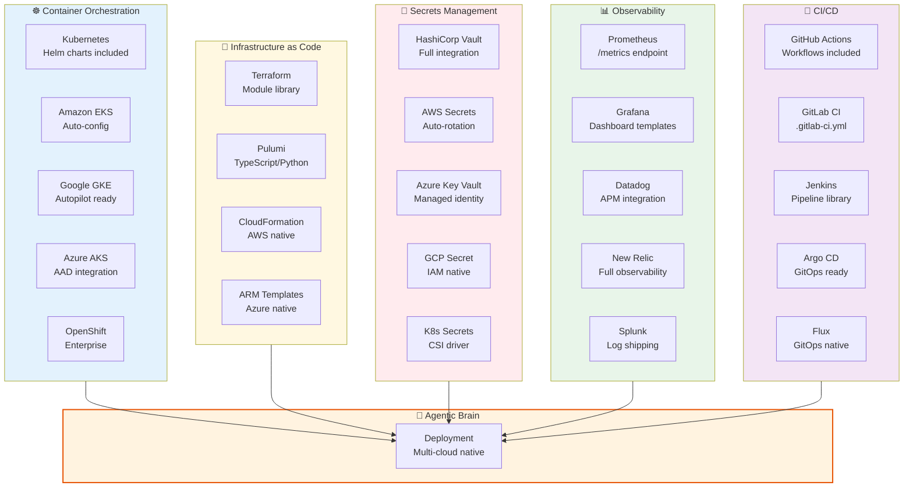
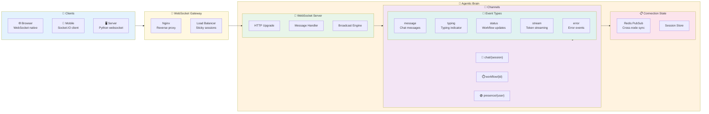
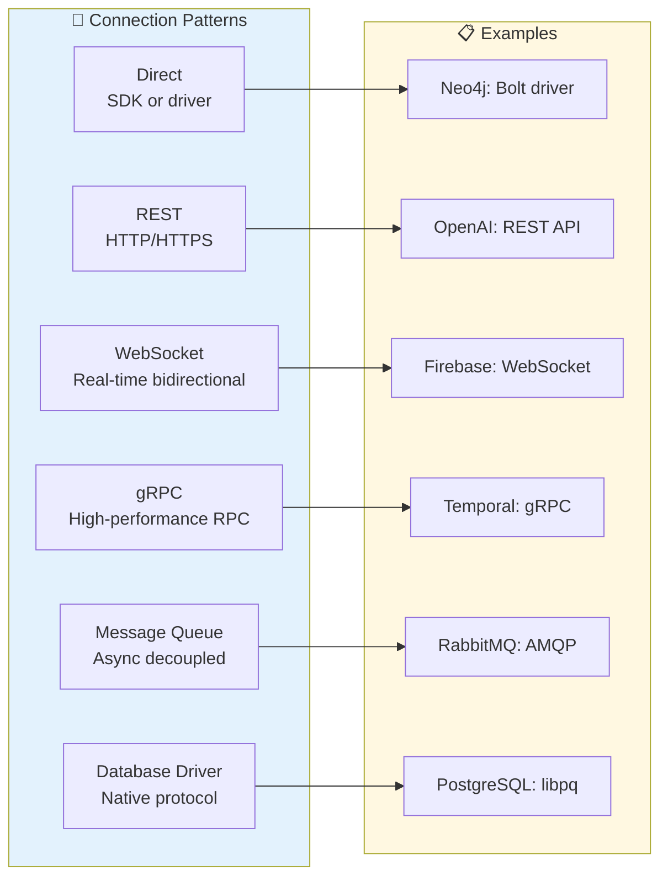

# 🔌 Agentic Brain Integrations

> Complete integration architecture showing all connection points

---

## 🌐 Integration Overview

High-level view of all integration categories and connection types.

---

## 🤖 LLM Provider Architecture

Intelligent routing across 8 LLM providers with automatic fallback.

---

## 🔵 Neo4j GraphRAG Integration

Deep integration with Neo4j for knowledge graph-powered RAG.

---

## 🔢 Vector Store Integrations

Multiple vector database options for embeddings storage and similarity search.

---

## 🔥 Firebase Real-Time Integration

Firebase integration for real-time sync and mobile/web apps.

---

## 📦 WordPress/WooCommerce/Divi Integration

CMS integration for content-driven AI applications.

---

## 📊 54 Data Loaders

Complete list of data source integrations organized by category.

---

## 🏗️ Infrastructure Integrations

Cloud and infrastructure platform connections.

---

## 🔌 WebSocket & Real-Time

Real-time communication architecture for live applications.

---

## 🔗 Integration Quick Reference

| Category | Integration | Protocol | Auth Method |
|----------|-------------|----------|-------------|
| **LLM** | Ollama | HTTP | None (local) |
| **LLM** | OpenAI | REST | API Key |
| **LLM** | Anthropic | REST | API Key |
| **LLM** | Azure | REST | AAD/API Key |
| **Database** | Neo4j | Bolt | User/Pass |
| **Database** | PostgreSQL | TCP | User/Pass |
| **Vector** | Pinecone | REST | API Key |
| **Vector** | Weaviate | GraphQL | API Key |
| **CMS** | WordPress | REST | OAuth/Key |
| **CMS** | WooCommerce | REST | Key/Secret |
| **Real-time** | Firebase | WebSocket | Service Account |
| **Cloud** | AWS S3 | REST | IAM/Keys |
| **Secrets** | Vault | HTTP | Token |

---

## 📐 Connection Patterns

---

**[← Architecture](./ARCHITECTURE.md)** · **[Back to README](../../README.md)**

*All integrations are production-ready with retry logic, connection pooling, and error handling.*

