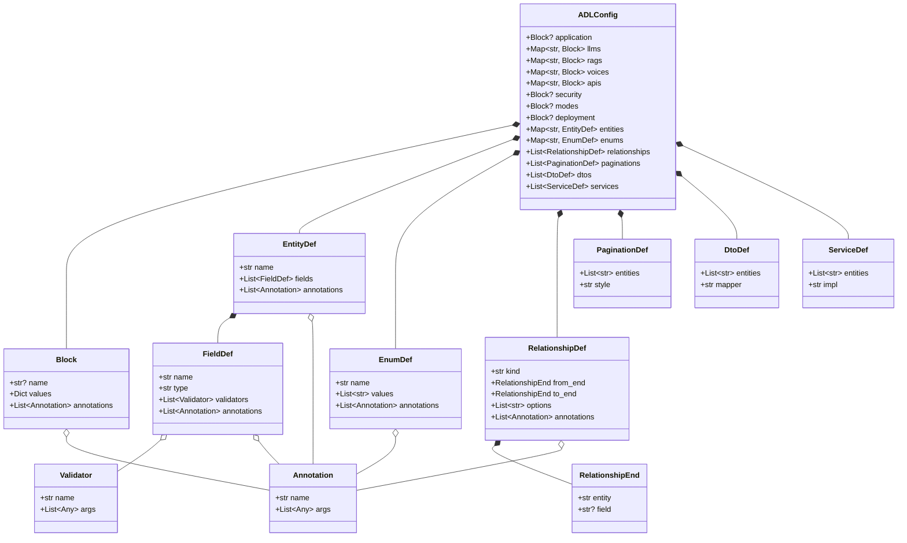
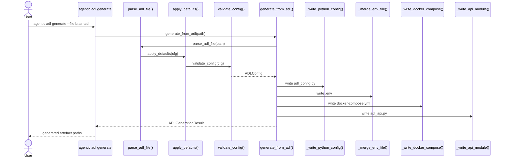
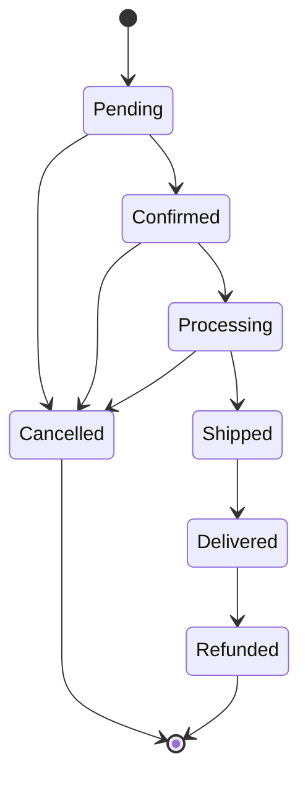
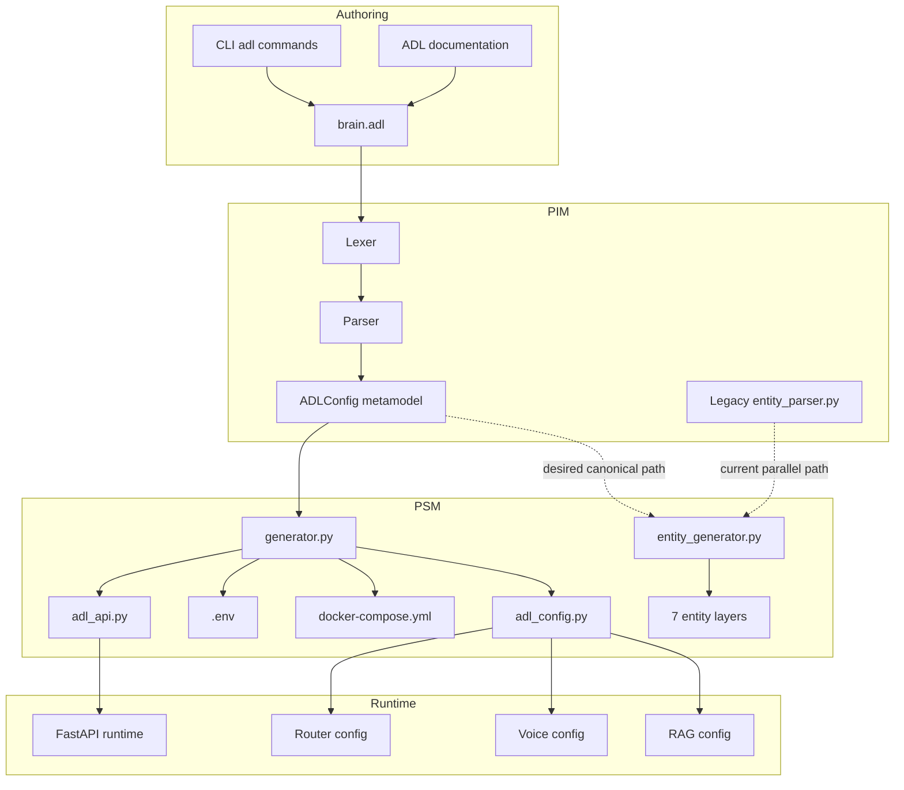

# OMG ADL Modeling Diagrams

## 1. ADL metamodel class diagram

```mermaid
classDiagram
    class ADLConfig {
        +Block? application
        +Map~str, Block~ llms
        +Map~str, Block~ rags
        +Map~str, Block~ voices
        +Map~str, Block~ apis
        +Block? security
        +Block? modes
        +Block? deployment
        +Map~str, EntityDef~ entities
        +Map~str, EnumDef~ enums
        +List~RelationshipDef~ relationships
        +List~PaginationDef~ paginations
        +List~DtoDef~ dtos
        +List~ServiceDef~ services
    }

    class Block {
        +str? name
        +Dict values
        +List~Annotation~ annotations
    }

    class Annotation {
        +str name
        +List~Any~ args
    }

    class EntityDef {
        +str name
        +List~FieldDef~ fields
        +List~Annotation~ annotations
    }

    class FieldDef {
        +str name
        +str type
        +List~Validator~ validators
        +List~Annotation~ annotations
    }

    class Validator {
        +str name
        +List~Any~ args
    }

    class EnumDef {
        +str name
        +List~str~ values
        +List~Annotation~ annotations
    }

    class RelationshipDef {
        +str kind
        +RelationshipEnd from_end
        +RelationshipEnd to_end
        +List~str~ options
        +List~Annotation~ annotations
    }

    class RelationshipEnd {
        +str entity
        +str? field
    }

    class PaginationDef {
        +List~str~ entities
        +str style
    }

    class DtoDef {
        +List~str~ entities
        +str mapper
    }

    class ServiceDef {
        +List~str~ entities
        +str impl
    }

    ADLConfig *-- Block
    ADLConfig *-- EntityDef
    ADLConfig *-- EnumDef
    ADLConfig *-- RelationshipDef
    ADLConfig *-- PaginationDef
    ADLConfig *-- DtoDef
    ADLConfig *-- ServiceDef
    Block o-- Annotation
    EntityDef *-- FieldDef
    EntityDef o-- Annotation
    FieldDef o-- Validator
    FieldDef o-- Annotation
    EnumDef o-- Annotation
    RelationshipDef *-- RelationshipEnd
    RelationshipDef o-- Annotation
```

## 2. ADL generation sequence diagram

```mermaid
sequenceDiagram
    actor User
    participant CLI as agentic adl generate
    participant Parser as parse_adl_file()
    participant Defaults as apply_defaults()
    participant Validator as validate_config()
    participant Generator as generate_from_adl()
    participant Config as _write_python_config()
    participant Env as _merge_env_file()
    participant Compose as _write_docker_compose()
    participant API as _write_api_module()

    User->>CLI: agentic adl generate --file brain.adl
    CLI->>Generator: generate_from_adl(path)
    Generator->>Parser: parse_adl_file(path)
    Parser->>Defaults: apply_defaults(cfg)
    Defaults->>Validator: validate_config(cfg)
    Validator-->>Generator: ADLConfig
    Generator->>Config: write adl_config.py
    Generator->>Env: write .env
    Generator->>Compose: write docker-compose.yml
    Generator->>API: write adl_api.py
    Generator-->>CLI: ADLGenerationResult
    CLI-->>User: generated artefact paths
```

## 3. Order lifecycle state diagram

```mermaid
stateDiagram-v2
    [*] --> Pending
    Pending --> Confirmed
    Pending --> Cancelled
    Confirmed --> Processing
    Confirmed --> Cancelled
    Processing --> Shipped
    Processing --> Cancelled
    Shipped --> Delivered
    Delivered --> Refunded
    Cancelled --> [*]
    Refunded --> [*]
```

## 4. ADL component diagram

```mermaid
graph TB
    subgraph Authoring
        ADLFile[brain.adl]
        CLI[CLI adl commands]
        Docs[ADL documentation]
    end

    subgraph PIM
        Lexer[Lexer]
        Parser[Parser]
        Model[ADLConfig metamodel]
        EntityParser[Legacy entity_parser.py]
    end

    subgraph PSM
        ConfigGen[generator.py]
        EntityGen[entity_generator.py]
        ConfigOut[adl_config.py]
        EnvOut[".env"]
        ComposeOut[docker-compose.yml]
        ApiOut[adl_api.py]
        LayerOut["7 entity layers"]
    end

    subgraph Runtime
        API[FastAPI runtime]
        Router[Router config]
        Voice[Voice config]
        RAG[RAG config]
    end

    CLI --> ADLFile
    Docs --> ADLFile
    ADLFile --> Lexer --> Parser --> Model
    Model --> ConfigGen
    Model -. desired canonical path .-> EntityGen
    EntityParser -. current parallel path .-> EntityGen

    ConfigGen --> ConfigOut
    ConfigGen --> EnvOut
    ConfigGen --> ComposeOut
    ConfigGen --> ApiOut
    EntityGen --> LayerOut

    ConfigOut --> Router
    ConfigOut --> Voice
    ConfigOut --> RAG
    ApiOut --> API
```
