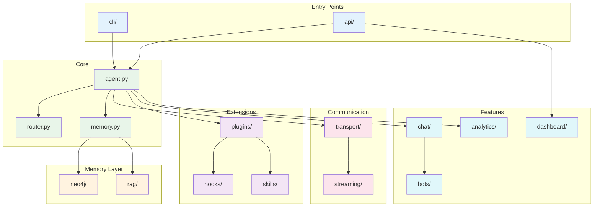

# Component Diagram

**Visual map of Agentic Brain modules and their relationships.**

---

## Module Dependencies



---

## File-Level View

```
src/agentic_brain/
│
├── __init__.py              # Package exports (Brain, Agent, etc.)
├── agent.py                 # 🧠 Core agent logic
├── router.py                # 🔀 LLM provider routing
├── memory.py                # 💾 Memory interface/base class
├── audio.py                 # 🔊 Audio processing
├── exceptions.py            # ⚠️ Custom exceptions
├── installer.py             # 📦 Package installer
│
├── api/                     # 🌐 FastAPI server
│   ├── __init__.py
│   ├── routes.py            # Endpoint definitions
│   ├── middleware.py        # Request/response middleware
│   └── dependencies.py      # Dependency injection
│
├── neo4j/                   # 🔷 Neo4j integration
│   ├── __init__.py
│   ├── driver.py            # Connection management
│   ├── queries.py           # Cypher queries
│   └── models.py            # Graph models
│
├── transport/               # 📡 Real-time transports
│   ├── __init__.py
│   ├── base.py              # Transport interface
│   ├── websocket.py         # WebSocket implementation
│   ├── sse.py               # Server-Sent Events
│   └── firebase.py          # Firebase Realtime DB
│
├── streaming/               # 🌊 Token streaming
│   ├── __init__.py
│   └── handlers.py          # Stream handlers
│
├── rag/                     # 🔍 RAG components
│   ├── __init__.py
│   ├── retriever.py         # Document retrieval
│   ├── embedder.py          # Embedding generation
│   └── chunker.py           # Text chunking
│
├── plugins/                 # 🔌 Plugin system
│   ├── __init__.py
│   ├── manager.py           # Plugin lifecycle
│   └── loader.py            # Plugin discovery
│
├── hooks/                   # 🪝 Event hooks
│   ├── __init__.py
│   └── lifecycle.py         # Lifecycle hooks
│
├── skills/                  # 🎯 Agent skills
│   ├── __init__.py
│   └── base.py              # Skill interface
│
├── chat/                    # 💬 Chat features
│   ├── __init__.py
│   ├── conversation.py      # Conversation management
│   └── templates.py         # Prompt templates
│
├── bots/                    # 🤖 Pre-built bots
│   ├── __init__.py
│   └── assistant.py         # Generic assistant
│
├── dashboard/               # 📊 Admin dashboard
│   ├── __init__.py
│   └── app.py               # Dashboard routes
│
├── analytics/               # 📈 Usage analytics
│   ├── __init__.py
│   └── tracker.py           # Event tracking
│
├── orchestration/           # 🎭 Multi-agent
│   ├── __init__.py
│   ├── crew.py              # Crew management
│   └── workflow.py          # Workflow engine
│
├── backup/                  # 💾 Backup utilities
│   └── __init__.py
│
├── benchmark/               # ⏱️ Performance testing
│   └── __init__.py
│
├── business/                # 💼 Business logic
│   └── __init__.py
│
├── cli/                     # 💻 Command-line interface
│   └── __init__.py
│
└── mcp/                     # 🔗 MCP integration
    └── __init__.py
```

---

## Dependency Flow

```
                              ┌───────────────┐
                              │   Entrypoint  │
                              │ (CLI or API)  │
                              └───────┬───────┘
                                      │
                                      ▼
                              ┌───────────────┐
                              │    Agent      │
                              │   agent.py    │
                              └───────┬───────┘
                                      │
              ┌───────────────────────┼───────────────────────┐
              │                       │                       │
              ▼                       ▼                       ▼
       ┌─────────────┐         ┌─────────────┐         ┌─────────────┐
       │   Router    │         │   Memory    │         │  Transport  │
       │  router.py  │         │  memory.py  │         │ transport/  │
       └──────┬──────┘         └──────┬──────┘         └──────┬──────┘
              │                       │                       │
    ┌─────────┼─────────┐            │               ┌────────┼────────┐
    │         │         │            │               │        │        │
    ▼         ▼         ▼            ▼               ▼        ▼        ▼
┌───────┐ ┌───────┐ ┌───────┐  ┌─────────┐     ┌────────┐ ┌─────┐ ┌────────┐
│Ollama │ │OpenAI │ │Claude │  │  Neo4j  │     │   WS   │ │ SSE │ │Firebase│
└───────┘ └───────┘ └───────┘  │  neo4j/ │     └────────┘ └─────┘ └────────┘
                               └────┬────┘
                                    │
                               ┌────┴────┐
                               │   RAG   │
                               │  rag/   │
                               └─────────┘
```

---

## Import Hierarchy

```python
# Top-level exports from __init__.py
from agentic_brain import (
    # Core
    Agent,              # agent.py
    Brain,              # agent.py (alias)
    Router,             # router.py
    
    # Memory
    Memory,             # memory.py
    Neo4jMemory,        # neo4j/
    
    # Transport
    WebSocketTransport, # transport/websocket.py
    SSETransport,       # transport/sse.py
    
    # Features
    Conversation,       # chat/conversation.py
    Skill,              # skills/base.py
    Plugin,             # plugins/manager.py
)
```

---

## Key Interfaces

### Agent (Core)

```python
class Agent:
    """Main entry point for chat interactions."""
    
    router: Router          # LLM routing
    memory: Memory          # Persistent memory
    transport: Transport    # Real-time streaming
    plugins: PluginManager  # Extensions
    
    def chat(message, user_id) -> str
    def stream(message, user_id) -> AsyncIterator[str]
```

### Router (LLM)

```python
class Router:
    """Routes requests to appropriate LLM provider."""
    
    providers: List[str]    # Available: ollama, openai, anthropic
    default: str            # Primary provider
    
    def generate(prompt, model=None) -> str
    def stream(prompt, model=None) -> AsyncIterator[str]
```

### Memory (Storage)

```python
class Memory(Protocol):
    """Interface for memory implementations."""
    
    def get_context(user_id) -> List[Message]
    def store_message(user_id, role, content) -> None
    def get_facts(user_id) -> List[Fact]
```

### Transport (Real-time)

```python
class Transport(Protocol):
    """Interface for real-time communication."""
    
    def send(message) -> None
    def receive() -> AsyncIterator[Message]
    def close() -> None
```
