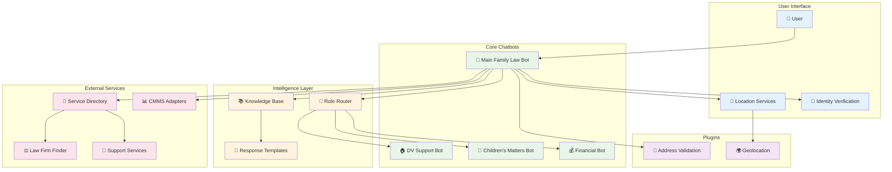
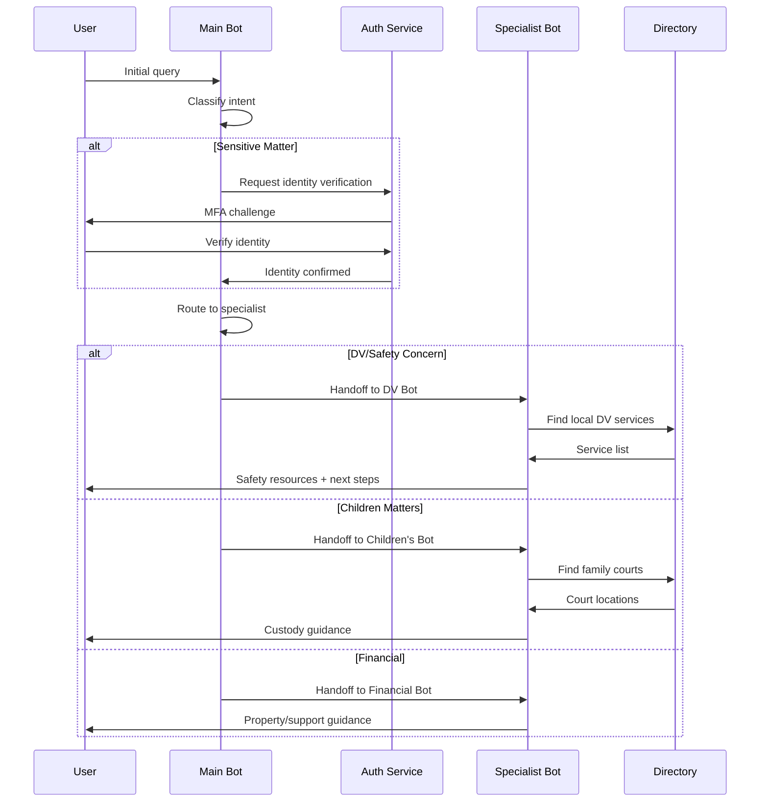
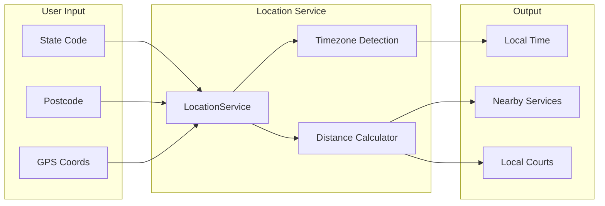
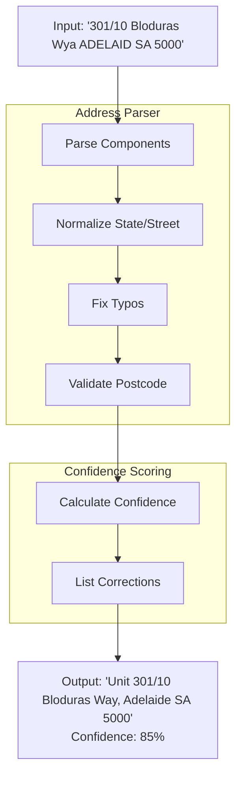
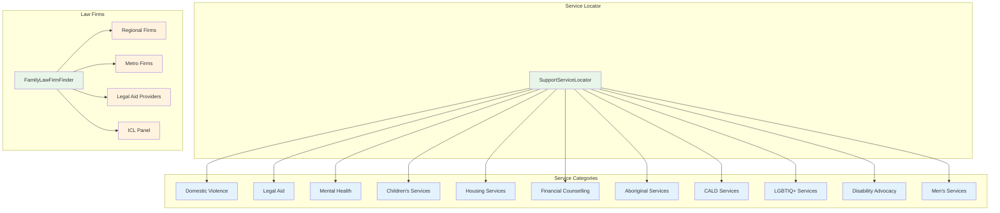
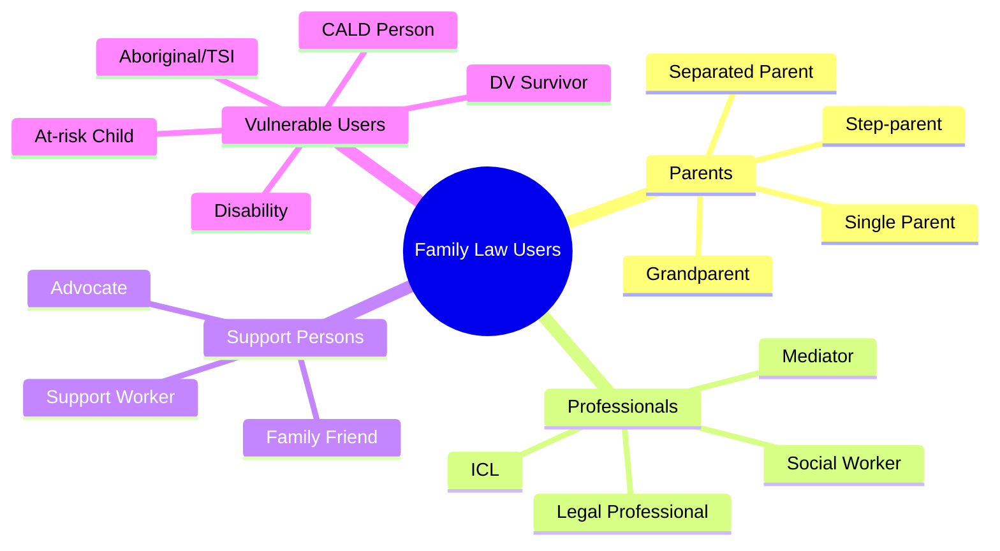
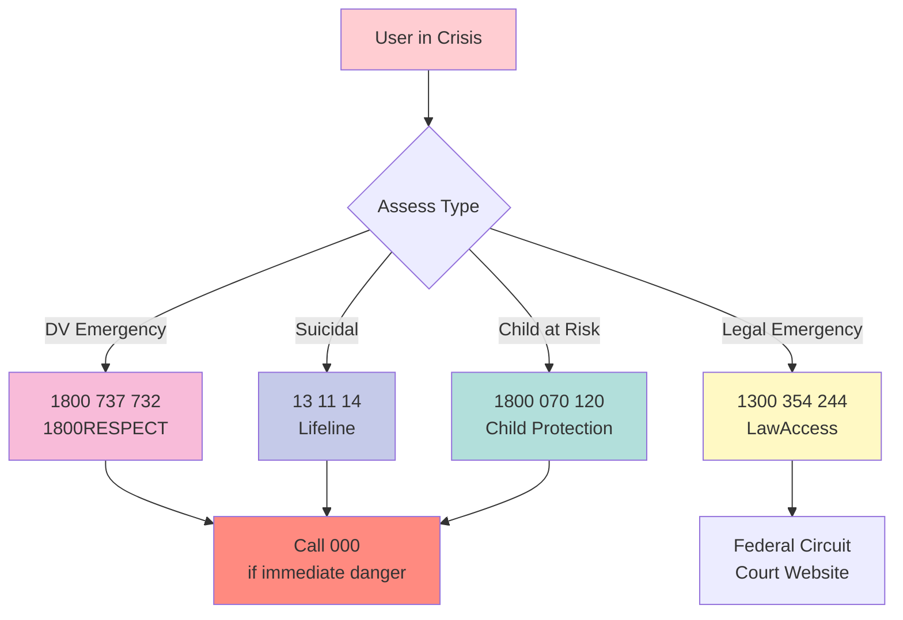

# Family Law Legal Aid Architecture

**Visual map of the Australian Family Law Legal Aid chatbot case study.**

---

## System Overview



---

## Bot-to-Bot Handoff Flow



---

## Location Services Flow



---

## Address Validation Plugin



---

## Service Directory Structure



---

## User Roles



---

## 24/7 Crisis Support Flow



---

## File Structure

```
examples/case-studies/family-law-legal-aid/
│
├── README.md                 # Case study overview
├── LICENSE                   # Apache-2.0
│
├── family_law_bot.py         # 🤖 Main chatbot
├── knowledge_base.py         # 📚 Legal knowledge
├── templates.py              # 📝 Response templates
├── case_manager.py           # 📋 Case management
│
├── user_roles.py             # 👥 Role definitions
├── architecture.py           # 🏗️ Multi-domain setup
├── cmms_adapters.py          # 📊 CMMS integration
│
├── support_services.py       # 🤝 Service directory
├── law_firms.py              # ⚖️ Law firm finder
│
└── tests/
    ├── test_bot.py
    ├── test_services.py
    └── test_law_firms.py
```

---

## Integration Points

| Integration | Purpose | Module |
|-------------|---------|--------|
| Location Services | User timezone/location | `agentic_brain.location` |
| Address Validation | Format addresses | `agentic_brain.plugins.address_validation` |
| Neo4j Memory | Conversation history | `agentic_brain.neo4j` |
| Bot-to-Bot Handoff | Specialist routing | `agentic_brain.bots.handoff` |
| Identity Verification | Sensitive matter access | `agentic_brain.auth` |

---

## Compliance Requirements

- **Apache-2.0 License**: Permissive open source license
- **WCAG 2.1 AA**: Accessibility for blind users
- **Australian Privacy Act**: Data handling requirements
- **Family Law Act 1975**: Legal accuracy requirements
- **National DV Framework**: Safety-first approach
